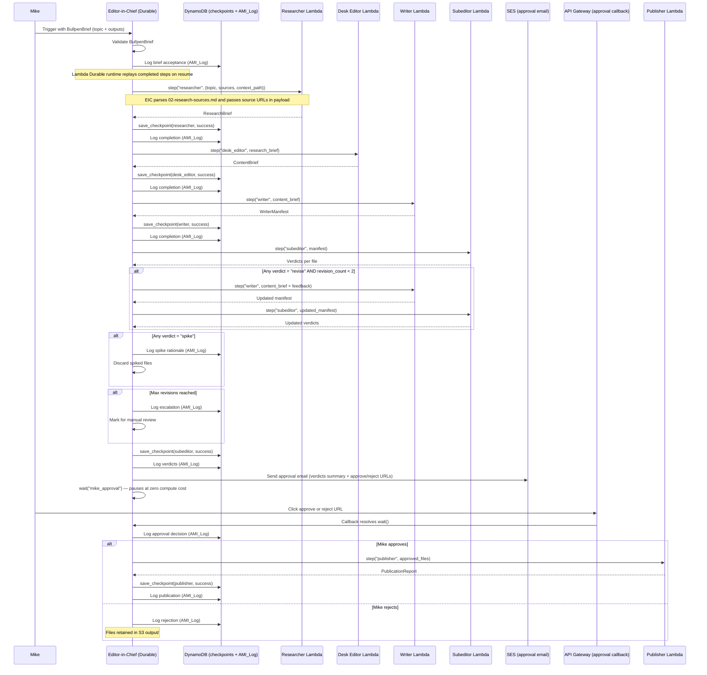
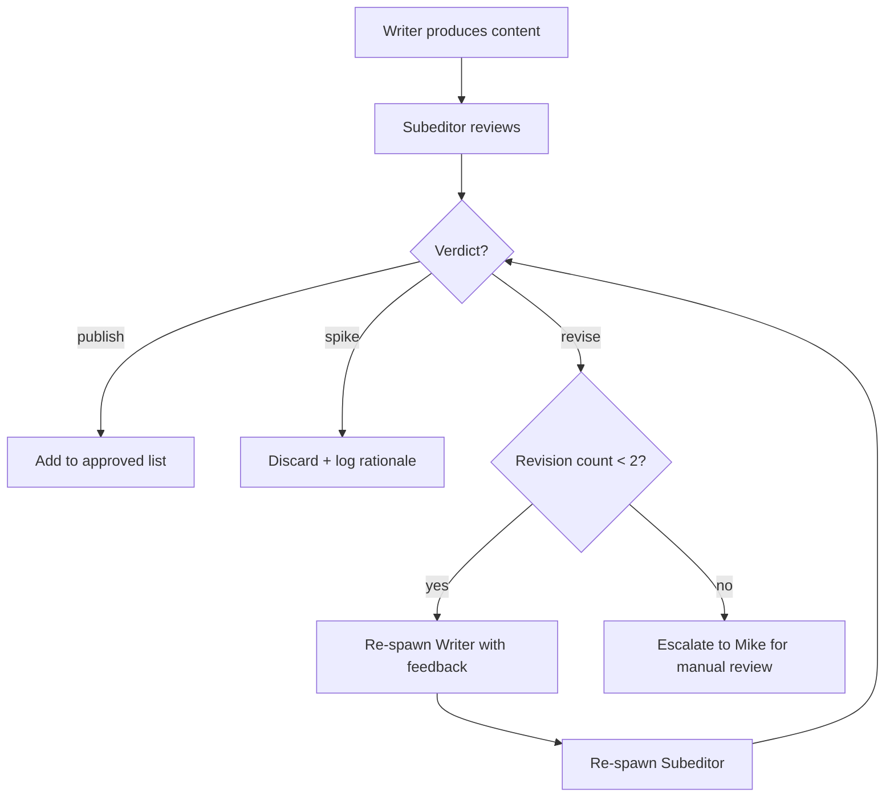

# Design Document — Bullpen Architecture

## Overview

The Bullpen Architecture replaces the existing Orchestrator_Agent + Writing_Sub_Agent pattern with a constrained multi-agent pipeline of six specialised agent types, orchestrated by an Editor-in-Chief. Each agent operates under the principle of least privilege: it receives only the output of its immediate predecessor, can only invoke AWS actions permitted by its IAM execution role, and writes to designated outputs only.

The pipeline runs in a fixed sequence: Researcher → Desk Editor → Writer → Subeditor → (Mike's approval gate) → Publisher. The Editor-in-Chief is implemented as a Lambda Durable Function using `step()` for each agent invocation and `wait()` for the approval gate. A separate Archivist Lambda (Whakaaro) runs on a nightly cadence outside the content pipeline. Tool allowlists are enforced at the IAM level — a Lambda with no S3 PutObject permission literally cannot write to S3 regardless of what the LLM requests.

The system reuses existing modules from `magic_content_engine/` (config, errors, model_router, steering, slug, s3_upload, models) and produces output bundles in the same structure as the current engine for backward compatibility. The S3 bucket is `mce-second-brain`.

## Architecture

### Pipeline Flow

```mermaid
graph TB
    subgraph Input
        WB[Weekly Brief<br/>topic + requested outputs]
    end

    subgraph EditorInChief["Editor-in-Chief (Lambda Durable Function)"]
        EIC[Editor-in-Chief<br/>step() per agent<br/>wait() for approval gate<br/>DynamoDB checkpoints + AMI_Log]
    end

    subgraph Pipeline["Agent Pipeline (Lambda Durable Functions)"]
        RA[Researcher Lambda<br/>Claude Haiku<br/>IAM: S3 GetObject mce-second-brain/ami-context/ only]
        DE[Desk Editor Lambda<br/>Claude Sonnet<br/>IAM: Bedrock only]
        WA[Writer Lambda<br/>Claude Sonnet / Haiku<br/>IAM: S3 PutObject output/ only]
        SA[Subeditor Lambda<br/>Claude Sonnet<br/>IAM: S3 GetObject output/ only]
        PA[Publisher Lambda<br/>Claude Haiku<br/>IAM: S3 PutObject output/ + SES]
    end

    subgraph ApprovalGate["Mike's Approval Gate"]
        MG[Manual approval<br/>before Publisher runs]
    end

    subgraph NightlyCadence["Nightly (separate Lambda)"]
        AR[Archivist Lambda<br/>Whakaaro<br/>IAM: S3 mce-second-brain/ami-context/ + archive/ only]
    end

    subgraph Storage
        S3C[S3 mce-second-brain/ami-context/<br/>nightly context feed]
        S3O[S3 mce-second-brain/output/<br/>published content]
    end

    WB --> EIC
    EIC -->|step()| RA
    RA -->|ResearchBrief| EIC
    EIC -->|step()| DE
    DE -->|ContentBrief| EIC
    EIC -->|step()| WA
    WA -->|WriterManifest| EIC
    EIC -->|step()| SA
    SA -->|Verdicts| EIC

    EIC -->|wait()| MG
    MG -->|approved files| EIC
    EIC -->|step()| PA
    PA --> S3O

    AR --> S3C

    RA -->|crawl| S3C
```

### Pipeline Sequence



### Revision Loop Detail



## Components and Interfaces

### 1. Editor-in-Chief

The top-level orchestrator. Implemented as a Lambda Durable Function. It does not generate content itself. It validates the BullpenBrief, invokes agents in sequence via `step()`, manages the revision loop, gates publication on Mike's approval via `wait()`, and writes all checkpoints and decisions to DynamoDB.

**System Prompt:**

```
Role: You are the Editor-in-Chief of a content production pipeline.

Allowed Actions:
- Validate incoming BullpenBriefs
- Invoke constrained agent Lambdas via step() in the durable execution SDK
- Read agent outputs returned from each step()
- Write checkpoints and log events to DynamoDB
- Send approval email via SES and pause via wait()
- Resume pipeline after Mike's approval callback

Hard Constraints:
- You MUST NOT generate content directly
- You MUST NOT write to S3 directly
- You MUST NOT send email outside the approval gate
- You MUST invoke agents in the fixed sequence: Researcher, Desk Editor, Writer, Subeditor, Publisher
- You MUST NOT invoke the next agent until the current step() completes
- You MUST NOT invoke the Publisher without Mike's explicit approval via wait()
- You MUST NOT invoke the Archivist during a content run

Input/Output Format:
- Input: BullpenBrief (JSON) with topic and requested_outputs
- Output: Final pipeline status with all checkpoints and log entries
```

**IAM Execution Role:** Lambda InvokeFunction (all `mce-*` functions), DynamoDB read/write (`mce-checkpoints`, `mce-run-history`), SES SendEmail (approval gate only), CloudWatch Logs.

### 2. Researcher Agent

Read-only agent that crawls web sources and reads from the nightly context feed in S3.

**System Prompt:**

```
Role: You are a research analyst for a weekly content pipeline focused on AI Engineering tooling on AWS (Kiro IDE, AgentCore, Strands, Bedrock) from the Aotearoa builder perspective.

Allowed Actions:
- Crawl web pages via HTTP GET
- Read from S3 path s3://mce-second-brain/ami-context/
- Score article relevance using Claude Haiku (1-5 scale)
- Return a structured Research Brief

Hard Constraints:
- You MUST NOT write to any S3 path
- You MUST NOT delete any S3 object
- You MUST NOT send email via SES
- You MUST NOT write to the local file system
- You MUST NOT send messages to any external service
- You MUST NOT access any S3 path outside mce-second-brain/ami-context/

Input/Output Format:
- Input: JSON with fields "topic" (string), "research_sources" (list of source URLs with primary/secondary classification), "context_feed_path" (S3 URI)
- Output: ResearchBrief JSON with fields "articles" (list of scored article objects), "sources_crawled" (list of URLs), "sources_failed" (list of URLs), "run_timestamp" (ISO 8601)
```

**IAM Execution Role:** `http_get`, `s3_get_object` (scoped to `mce-second-brain/ami-context/` prefix), `claude_haiku_invoke`

**Model:** Claude Haiku

### 3. Desk Editor Agent

Reads a research brief and produces a content brief. No web access.

**System Prompt:**

```
Role: You are a desk editor for a weekly content pipeline. You read research briefs and produce content briefs with editorial angle, tone guidance, and article selection.

Allowed Actions:
- Read steering files from .kiro/steering/
- Structure content briefs using Claude Sonnet
- Select articles from the Research Brief for content production

Hard Constraints:
- You MUST NOT access the web via HTTP
- You MUST NOT access S3
- You MUST NOT send email via SES
- You MUST NOT write files outside the Content Brief output
- You MUST NOT send messages to any external service

Input/Output Format:
- Input: JSON with fields "research_brief" (ResearchBrief object), "topic" (string from Weekly Brief)
- Output: ContentBrief JSON with fields "selected_articles" (list), "editorial_angle" (string), "tone_guidance" (string referencing voice rules), "output_types" (list of strings), "run_timestamp" (ISO 8601)
```

**IAM Execution Role:** `file_read` (scoped to `.kiro/steering/`), `claude_sonnet_invoke`

**Model:** Claude Sonnet

### 4. Writer Agent

Reads a content brief and writes content files to `output/` only.

**System Prompt:**

```
Role: You are a content writer for a weekly content pipeline focused on AI Engineering tooling on AWS from the Aotearoa builder perspective.

Allowed Actions:
- Read steering files from .kiro/steering/
- Write content files to the output/ directory
- Generate narrative content via Claude Sonnet (blog, YouTube, CFP, user group)
- Generate digest email via Claude Haiku

Hard Constraints:
- You MUST NOT access the web via HTTP
- You MUST NOT access S3
- You MUST NOT send email via SES
- You MUST NOT write files outside the output/ directory
- You MUST NOT modify scripts, configuration, or source code
- You MUST NOT send messages to any external service
- You MUST apply Voice Rules: no banned phrases (leverage, empower, unlock, dive into, game-changer), no em-dashes, no opening paragraphs with "I", short sentences, proper <!-- MIKE: --> placeholder format

Input/Output Format:
- Input: JSON with fields "content_brief" (ContentBrief object), "steering_base_path" (string), "output_dir" (string), "revision_feedback" (optional string, present only during revision re-spawns with Subeditor feedback)
- Output: WriterManifest JSON with fields "files_written" (list of {path, output_type, word_count}), "voice_rules_applied" (boolean, always true), "run_timestamp" (ISO 8601)
```

**IAM Execution Role:** `file_read` (scoped to `.kiro/steering/`), `file_write` (scoped to `output/`), `claude_sonnet_invoke`, `claude_haiku_invoke`

**Model:** Claude Sonnet (narrative), Claude Haiku (digest email)

### 5. Subeditor Agent

Strictly read-only reviewer that returns verdicts.

**System Prompt:**

```
Role: You are a subeditor and quality reviewer. You read content files and return a verdict for each: publish, revise, or spike.

Allowed Actions:
- Read content files from the output/ directory
- Read steering files from .kiro/steering/
- Evaluate content against Voice Rules and output templates

Hard Constraints:
- You MUST NOT write to any file
- You MUST NOT access the web via HTTP
- You MUST NOT access S3
- You MUST NOT send email via SES
- You MUST NOT send messages to any external service
- You MUST NOT modify any content — you review only

Input/Output Format:
- Input: JSON with fields "manifest" (WriterManifest object), "output_dir" (string)
- Output: JSON with fields "verdicts" (list of {filename, verdict: publish|revise|spike, feedback: string}), "run_timestamp" (ISO 8601)
```

**IAM Execution Role:** `file_read` (scoped to `output/` and `.kiro/steering/`)

**Model:** Claude Sonnet

### 6. Publisher Agent

Uploads approved content to S3 and sends notification email. Runs only after Mike's approval.

**System Prompt:**

```
Role: You are a publisher. You upload approved content files to S3 and send notification email via SES.

Allowed Actions:
- Read files from the output/ directory
- Upload files to S3 bucket mce-second-brain under the output/ prefix
- Send notification email via SES

Hard Constraints:
- You MUST NOT delete any S3 object
- You MUST NOT write to the local file system
- You MUST NOT access external URLs via HTTP
- You MUST NOT modify scripts, configuration, or source code
- You MUST only upload files that received a "publish" verdict

Input/Output Format:
- Input: JSON with fields "approved_files" (list of {local_path, filename}), "output_dir" (string), "s3_bucket" (string), "s3_key_prefix" (string)
- Output: PublicationReport JSON with fields "files_uploaded" (list of {local_path, s3_key}), "email_sent" (boolean), "email_recipient" (string), "run_timestamp" (ISO 8601)
```

**IAM Execution Role:** `file_read` (scoped to `output/`), `s3_put_object` (scoped to `output/` prefix in bucket `mce-second-brain`), `ses_send_email`

**Model:** Claude Haiku

### 7. Archivist Agent (Whakaaro)

Nightly-only agent, separate from the content pipeline. Entry point at `mce-archivist Lambda`.

**System Prompt:**

```
Role: You are the knowledge archivist (Whakaaro). You read from the nightly context feed and maintain the long-term knowledge archive.

Allowed Actions:
- Read from S3 path s3://mce-second-brain/ami-context/
- Write to S3 path s3://mce-second-brain/archive/
- Read local context files

Hard Constraints:
- You MUST NOT publish content
- You MUST NOT send email via SES
- You MUST NOT access external URLs via HTTP
- You MUST NOT modify scripts or configuration files
- You MUST NOT write to any S3 path outside archive/

Input/Output Format:
- Input: JSON with fields "context_feed_path" (S3 URI), "run_date" (ISO 8601)
- Output: JSON with fields "items_archived" (int), "run_timestamp" (ISO 8601)
```

**IAM Execution Role:** `s3_get_object` (scoped to `mce-second-brain/ami-context/`), `s3_put_object` (scoped to `archive/`), `file_read` (scoped to local context files in the workspace, excluding scripts/ and config)

### Tool Allowlist Enforcement

The `lambda_invoke_step` runtime enforces tool allowlists at the execution layer, not just the prompt layer. This means even if an agent's LLM output requests a disallowed tool, the runtime rejects the call before execution.

**Enforcement mechanism:**

```python
def spawn_agent(
    system_prompt: str,
    tool_allowlist: list[str],
    input_payload: dict,
    run_dir: str,
) -> dict:
    """Spawn a constrained agent via Lambda Durable Functions step().

    The tool_allowlist is passed as a runtime parameter to lambda_invoke_step,
    which restricts the agent's available tools to only those listed.
    If the agent attempts a tool call outside the allowlist, lambda_invoke_step
    raises a ToolNotAllowedError which the Editor-in-Chief catches and logs.
    """
    try:
        return lambda_invoke_step(
            system_prompt=system_prompt,
            allowed_tools=tool_allowlist,  # runtime enforcement
            input=input_payload,
        )
    except ToolNotAllowedError as exc:
        ami_log.log_event(AMILogEvent(
            event_type="tool_violation",
            agent_type=exc.agent_type,
            timestamp=now_iso(),
            details={
                "attempted_tool": exc.tool_name,
                "allowed_tools": tool_allowlist,
                "error": str(exc),
            },
        ), run_dir)
        raise
```

**Key points:**
- Tool allowlists are enforced by the Lambda Durable Functions `lambda_invoke_step` runtime, not by prompt instructions alone (REQ-20.1, REQ-20.2)
- Violations are caught and logged in the AMI_Log with the attempted tool name and the allowed set (REQ-20.3)
- The Editor-in-Chief re-raises the error after logging, which triggers the standard error handling path (checkpoint + halt or continue depending on agent criticality)

### Tool Allowlist Summary

| Agent | http_get | s3_get | s3_put | s3_delete | ses_send | file_read | file_write | claude_haiku | claude_sonnet |
|---|---|---|---|---|---|---|---|---|---|
| Researcher | ✓ | ✓ (mce-second-brain/ami-context/) | ✗ | ✗ | ✗ | ✗ | ✗ | ✓ | ✗ |
| Desk Editor | ✗ | ✗ | ✗ | ✗ | ✗ | ✓ (.kiro/steering/) | ✗ | ✗ | ✓ |
| Writer | ✗ | ✗ | ✗ | ✗ | ✗ | ✓ (.kiro/steering/) | ✓ (output/) | ✓ | ✓ |
| Subeditor | ✗ | ✗ | ✗ | ✗ | ✗ | ✓ (output/ + .kiro/steering/) | ✗ | ✗ | ✓ |
| Publisher | ✗ | ✗ | ✓ (output/ prefix) | ✗ | ✓ | ✓ (output/) | ✗ | ✓ | ✗ |
| Archivist | ✗ | ✓ (mce-second-brain/ami-context/) | ✓ (archive/) | ✗ | ✗ | ✓ | ✗ | ✗ | ✗ |

### Model Routing Per Agent

Extends the existing `magic_content_engine/model_router.py` with bullpen-specific task types:

```python
from enum import Enum
from magic_content_engine.config import HAIKU_MODEL_ID, SONNET_MODEL_ID

class BullpenTaskType(Enum):
    RESEARCH_SCORING = "research_scoring"           # Haiku
    DESK_EDITORIAL = "desk_editorial"               # Sonnet
    WRITER_NARRATIVE = "writer_narrative"            # Sonnet
    WRITER_DIGEST = "writer_digest"                  # Haiku
    SUBEDITOR_REVIEW = "subeditor_review"            # Sonnet
    PUBLISHER_EMAIL = "publisher_email"              # Haiku

BULLPEN_MODEL_ROUTING: dict[BullpenTaskType, str] = {
    BullpenTaskType.RESEARCH_SCORING: HAIKU_MODEL_ID,
    BullpenTaskType.DESK_EDITORIAL: SONNET_MODEL_ID,
    BullpenTaskType.WRITER_NARRATIVE: SONNET_MODEL_ID,
    BullpenTaskType.WRITER_DIGEST: HAIKU_MODEL_ID,
    BullpenTaskType.SUBEDITOR_REVIEW: SONNET_MODEL_ID,
    BullpenTaskType.PUBLISHER_EMAIL: HAIKU_MODEL_ID,
}

def get_bullpen_model(task: BullpenTaskType) -> str:
    return BULLPEN_MODEL_ROUTING[task]
```

### 8. DynamoDB (mce-checkpoints) — Checkpoint/Resume

Provides checkpoint persistence for pipeline resumption on failure.

```python
"""Checkpoint/resume for the bullpen pipeline.

Stores Checkpoint records as JSON in the run's output directory.
Enables the Editor-in-Chief to resume from the last successful agent
on failure.
"""

import json
from pathlib import Path
from dataclasses import asdict

def save_checkpoint(checkpoint: "Checkpoint", run_dir: str) -> None:
    """Append a checkpoint to checkpoints.json in the run directory."""
    path = Path(run_dir) / "checkpoints.json"
    existing = _load_raw(path)
    existing.append(asdict(checkpoint))
    path.write_text(json.dumps(existing, indent=2, default=str))

def load_checkpoints(run_dir: str) -> list[dict]:
    """Load all checkpoints for a run. Returns [] if file missing."""
    path = Path(run_dir) / "checkpoints.json"
    return _load_raw(path)

def get_last_successful(run_dir: str) -> dict | None:
    """Return the most recent checkpoint with status='success', or None."""
    checkpoints = load_checkpoints(run_dir)
    successes = [c for c in checkpoints if c.get("status") == "success"]
    return successes[-1] if successes else None

def _load_raw(path: Path) -> list[dict]:
    if not path.exists():
        return []
    return json.loads(path.read_text())
```

### 9. DynamoDB (mce-run-history) — Structured Decision Logging

Append-only JSON Lines log for full pipeline auditability. This is Ami-log (DynamoDB mce-run-history).

```python
"""Ami-log (DynamoDB mce-run-history) — structured append-only logging for the bullpen pipeline.

Writes one JSON object per line to agent-log.jsonl in the run's output directory.
"""

import json
from datetime import datetime, timezone
from pathlib import Path
from dataclasses import asdict

def log_event(event: "AMILogEvent", run_dir: str) -> None:
    """Append a structured event to agent-log.jsonl."""
    path = Path(run_dir) / "agent-log.jsonl"
    line = json.dumps(asdict(event), default=str)
    with path.open("a", encoding="utf-8") as f:
        f.write(line + "\n")

def read_log(run_dir: str) -> list[dict]:
    """Read all events from agent-log.jsonl. Returns [] if file missing."""
    path = Path(run_dir) / "agent-log.jsonl"
    if not path.exists():
        return []
    events = []
    for line in path.read_text(encoding="utf-8").splitlines():
        if line.strip():
            events.append(json.loads(line))
    return events
```

### 10. mce-archivist Lambda — Archivist Entry Point

```python
"""Whakaaro — the Archivist Agent entry point.

Runs on a nightly cadence, reads from the S3 nightly context feed,
and updates the long-term knowledge archive. Separate from the
content pipeline.
"""

import argparse
import logging
from datetime import date

logger = logging.getLogger(__name__)

def main(argv: list[str] | None = None) -> None:
    parser = argparse.ArgumentParser(description="Whakaaro — nightly knowledge archivist")
    parser.add_argument("--run-date", default=None, help="Override run date (YYYY-MM-DD)")
    args = parser.parse_args(argv)

    run_date = date.fromisoformat(args.run_date) if args.run_date else date.today()
    logger.info("Whakaaro starting — run_date=%s", run_date)

    # Read from nightly context feed
    context_feed_path = "s3://mce-second-brain/ami-context/"
    # ... spawn Archivist_Agent via Lambda Durable Functions step() with constrained tools ...

if __name__ == "__main__":
    main()
```

### 11. Integration with Existing Modules

The bullpen reuses these existing `magic_content_engine/` modules:

| Module | Usage in Bullpen |
|---|---|
| `config.py` | S3 bucket, model IDs, steering path, retry config |
| `errors.py` | `ErrorCollector`, `StepError`, `retry_s3` for Publisher retries |
| `model_router.py` | Extended with `BullpenTaskType` enum and routing map |
| `steering.py` | `load_steering()` used by Writer and Subeditor agents. Also parsed by Editor-in-Chief to extract research source URLs from `02-research-sources.md` before passing them to the Researcher in its input payload |
| `slug.py` | `generate_slug()`, `make_output_dirname()` for output directory naming |
| `s3_upload.py` | `S3ClientProtocol`, `upload_approved_files()` used by Publisher |
| `models.py` | `Article`, `ArticleMetadata`, `APACitation` reused internally by Researcher. `ScoredArticle` is the bullpen-specific lightweight projection passed through the pipeline |

**Note on `lambda_invoke_step`:** The bullpen uses the Lambda Durable Functions `lambda_invoke_step` runtime directly for agent spawning. This is not related to AgentCore Gateway (`gateway.py`). The existing `gateway.py` module is not used by the bullpen pipeline.

### 12. Mike's Approval Gate

The approval gate sits between the Subeditor and Publisher stages. It is synchronous and blocking.

```python
def run_approval_gate(
    verdicts: list["Verdict"],
    files: dict[str, str],
    output_dir: str,
    input_fn: Callable[[str], str] = input,
) -> tuple[list[str], bool]:
    """Present verdict summary to Mike and wait for approval.

    Shows filename, word count, and first 3 lines per file.
    Returns (approved_filenames, was_approved).
    """
    publishable = [v for v in verdicts if v.verdict == "publish"]
    if not publishable:
        return [], False

    print("\n" + "=" * 60)
    print("Approval Gate — files ready for publication:")
    print("=" * 60)
    for v in publishable:
        filepath = Path(output_dir) / v.filename
        word_count = len(filepath.read_text().split()) if filepath.exists() else 0
        first_lines = ""
        if filepath.exists():
            lines = filepath.read_text().splitlines()[:3]
            first_lines = "\n    ".join(lines)
        print(f"  ✓ {v.filename} ({word_count} words)")
        if first_lines:
            print(f"    {first_lines}")
    
    spiked = [v for v in verdicts if v.verdict == "spike"]
    for v in spiked:
        print(f"  ✗ {v.filename} (spiked: {v.feedback})")
    
    escalated = [v for v in verdicts if v.verdict == "revise"]
    for v in escalated:
        print(f"  ⚠ {v.filename} (escalated for manual review)")

    response = input_fn("\nApprove publication? [y/N]: ").strip().lower()
    approved = response in ("y", "yes")
    
    if approved:
        return [v.filename for v in publishable], True
    return [], False
```


## Data Models

All new dataclasses for the bullpen pipeline. These complement the existing models in `magic_content_engine/models.py`.

### BullpenBrief

```python
@dataclass
class BullpenBrief:
    """Input to the Editor-in-Chief to initiate a content run.

    Named BullpenBrief (not WeeklyBrief) to avoid collision with the
    existing WeeklyBrief dataclass in magic_content_engine/models.py,
    which tracks engagement metrics, topic coverage, and recommended
    focus for the original single-agent pipeline.
    """
    topic: str                                    # non-empty topic string
    requested_outputs: list[str]                  # at least one from: blog, youtube, cfp, usergroup, digest
    run_date: date = field(default_factory=date.today)
```

### ResearchBrief

```python
@dataclass
class ScoredArticle:
    """A single article with relevance score from the Researcher.

    This is a lightweight bullpen-specific model. It maps to the existing
    Article dataclass in magic_content_engine/models.py as follows:
      - title, url, source map directly
      - relevance_score maps to Article.relevance_score
      - summary is new (one-sentence, generated by Researcher)
      - Article.source_type, discovered_date, scoring_rationale, status
        are not carried through the bullpen pipeline (they remain in
        the Researcher's internal state only)
    """
    title: str
    url: str
    source: str
    relevance_score: int                          # 1-5
    summary: str                                  # one-sentence summary

@dataclass
class ResearchBrief:
    """Output of the Researcher Agent."""
    articles: list[ScoredArticle]
    sources_crawled: list[str]                    # URLs attempted
    sources_failed: list[str]                     # URLs that failed after retries
    run_timestamp: str                            # ISO 8601
```

### ContentBrief

```python
@dataclass
class ContentBrief:
    """Output of the Desk Editor Agent."""
    selected_articles: list[ScoredArticle]        # subset of ResearchBrief articles
    editorial_angle: str
    tone_guidance: str                            # references voice rules
    output_types: list[str]                       # requested output type strings
    run_timestamp: str                            # ISO 8601
```

### WriterManifest

```python
@dataclass
class FileEntry:
    """A single file written by the Writer Agent."""
    path: str                                     # relative to output/
    output_type: str                              # blog, youtube, cfp, usergroup, digest
    word_count: int

@dataclass
class WriterManifest:
    """Output of the Writer Agent."""
    files_written: list[FileEntry]
    voice_rules_applied: bool = True              # always True
    run_timestamp: str = ""                       # ISO 8601

@dataclass
class WriterInput:
    """Input to the Writer Agent, including optional revision feedback."""
    content_brief: ContentBrief
    steering_base_path: str
    output_dir: str
    revision_feedback: str | None = None          # present only during revision re-spawns
```

### Verdict

```python
@dataclass
class Verdict:
    """Subeditor's assessment of a single content file."""
    filename: str
    verdict: str                                  # "publish" | "revise" | "spike"
    feedback: str                                 # specific feedback for revise, rationale for spike, empty for publish
```

### SubeditorReview

```python
@dataclass
class SubeditorReview:
    """Output of the Subeditor Agent."""
    verdicts: list[Verdict]
    run_timestamp: str                            # ISO 8601
```

### PublicationReport

```python
@dataclass
class PublicationReport:
    """Output of the Publisher Agent."""
    files_uploaded: list[dict]                    # [{local_path, s3_key}]
    email_sent: bool
    email_recipient: str
    run_timestamp: str                            # ISO 8601
```

### Checkpoint

```python
# Canonical agent_type values (snake_case, used in Checkpoint and AMILogEvent):
AGENT_TYPES = ["researcher", "desk_editor", "writer", "subeditor", "publisher", "archivist"]

@dataclass
class Checkpoint:
    """Progress record written after each agent completes."""
    agent_type: str                               # one of AGENT_TYPES: researcher, desk_editor, writer, subeditor, publisher
    timestamp: str                                # ISO 8601
    input_hash: str                               # SHA-256 of input payload
    output_hash: str                              # SHA-256 of output payload
    status: str                                   # "success" | "failed"
    output_path: str = ""                         # relative path to serialised output file for checkpoint recovery
```

### AMILogEvent

```python
@dataclass
class AMILogEvent:
    """A single structured event in Ami-log (DynamoDB mce-run-history)."""
    event_type: str                               # spawn, completion, verdict, approval, error
    timestamp: str                                # ISO 8601
    agent_type: str                               # which agent this event relates to
    details: dict                                 # event-specific payload (input_hash, output_hash, duration, verdict, feedback, etc.)
```

### Serialisation Contract

All data models above are Python dataclasses and must satisfy the round-trip property: `json.loads(json.dumps(asdict(obj), default=str))` produces a dict equivalent to `asdict(obj)` for all valid instances. This is enforced via `dataclasses.asdict()` for serialisation and constructor kwargs for deserialisation.


## Correctness Properties

*A property is a characteristic or behavior that should hold true across all valid executions of a system — essentially, a formal statement about what the system should do. Properties serve as the bridge between human-readable specifications and machine-verifiable correctness guarantees.*

### Property 1: BullpenBrief validation correctness

*For any* BullpenBrief instance, the Editor-in-Chief validation function should accept the brief if and only if the topic is a non-empty, non-whitespace string and the requested_outputs list contains at least one valid output type from {blog, youtube, cfp, usergroup, digest}. All other briefs should be rejected with a descriptive validation error.

**Validates: Requirements 1.1, 1.2**

### Property 2: Data model serialisation round-trip

*For any* valid instance of ResearchBrief, ContentBrief, WriterManifest, SubeditorReview, PublicationReport, Checkpoint, or AMILogEvent, serialising the instance to JSON via `json.dumps(asdict(obj), default=str)` and deserialising back via `json.loads()` should produce a dict equivalent to `asdict(obj)`.

**Validates: Requirements 4.3, 6.3, 15.4, 16.5**

### Property 3: Pipeline spawn sequence

*For any* valid BullpenBrief that passes validation, the Editor-in-Chief should spawn agents in exactly the order: Researcher, Desk Editor, Writer, Subeditor, Publisher. No agent should be spawned out of order, and no agent should be spawned before its predecessor completes.

**Validates: Requirements 2.2, 22.1, 22.2**

### Property 4: Predecessor-only input passing

*For any* agent spawn in the pipeline, the input payload should contain only the output of the immediately preceding agent (or the BullpenBrief for the Researcher). No agent should receive outputs from earlier pipeline stages beyond its immediate predecessor.

**Validates: Requirements 2.3**

### Property 5: Model routing correctness

*For any* BullpenTaskType, the model router should return Claude Haiku for RESEARCH_SCORING, WRITER_DIGEST, and PUBLISHER_EMAIL, and Claude Sonnet for DESK_EDITORIAL, WRITER_NARRATIVE, and SUBEDITOR_REVIEW.

**Validates: Requirements 21.1, 21.2, 21.3, 21.4, 21.5**

### Property 6: System prompt structure consistency

*For any* agent type in the bullpen (Researcher, Desk Editor, Writer, Subeditor, Publisher, Archivist), the system prompt should contain all four required sections (Role, Allowed Actions, Hard Constraints, Input/Output Format), all prohibition statements should use the phrase "You MUST NOT", and the Tool Allowlist should be explicitly listed.

**Validates: Requirements 19.1, 19.2, 19.3**

### Property 7: Verdict completeness and feedback

*For any* set of content files reviewed by the Subeditor, the returned verdicts list should contain exactly one verdict per input file, each verdict should be one of "publish", "revise", or "spike", and verdicts with "revise" or "spike" should have non-empty feedback strings.

**Validates: Requirements 9.4, 9.5, 9.6**

### Property 8: Revision loop bounded at two cycles

*For any* content file that receives consecutive "revise" verdicts, the Editor-in-Chief should re-spawn the Writer at most two times. After two revision cycles without a "publish" verdict, the file should be escalated to manual review and no further Writer spawns should occur for that file.

**Validates: Requirements 11.2, 11.3**

### Property 9: Spike verdict discards without re-spawn

*For any* content file that receives a "spike" verdict, the Editor-in-Chief should discard the file, log the spike rationale in the AMI_Log, and not re-spawn the Writer for that file regardless of the revision count.

**Validates: Requirements 11.4**

### Property 10: Only publish-verdict files reach Publisher

*For any* set of verdicts after all revision loops complete and Mike approves, the Publisher should receive only files with a "publish" verdict. No file with a "revise", "spike", or "escalated" status should appear in the Publisher's input.

**Validates: Requirements 12.4, 14.2**

### Property 11: Output filename mapping

*For any* requested output type, the Writer should produce a file with the correct filename: "blog" → post.md, "youtube" → script.md + description.txt, "cfp" → cfp-proposal.md, "usergroup" → usergroup-session.md, "digest" → digest-email.txt. The output directory should follow the pattern `YYYY-MM-DD-[slug]/`.

**Validates: Requirements 8.3, 27.1**

### Property 12: AMI_Log event structure and append-only format

*For any* sequence of AMILogEvent instances written via `ami_log.log_event()`, the resulting agent-log.jsonl file should contain one valid JSON object per line, each object should contain the fields event_type, timestamp, agent_type, and details, and reading the log back via `read_log()` should return all events in insertion order.

**Validates: Requirements 16.4, 24.2, 24.3**

### Property 13: Agent lifecycle events logged

*For any* agent spawned during a pipeline run, the AMI_Log should contain both a spawn event (with agent_type and timestamp) and either a completion event (with output_hash and duration) or an error event. No agent spawn should go unlogged.

**Validates: Requirements 16.2, 16.3**

### Property 14: Checkpoint recorded on agent success

*For any* agent that completes successfully in the pipeline, a Checkpoint should be recorded via `workflow.save_checkpoint()` containing the correct agent_type, a valid ISO 8601 timestamp, input_hash, output_hash, and status "success".

**Validates: Requirements 15.1**

### Property 15: Partial failure continuation

*For any* set of output types where the Writer fails on a subset, the Editor-in-Chief should skip the failed types and continue processing the remaining types. Similarly, for any set of files where the Publisher fails on a subset, the Publisher should continue uploading the remaining files.

**Validates: Requirements 26.3, 26.5**

### Property 16: S3 key prefix format

*For any* file uploaded by the Publisher, the S3 key should match the pattern `output/YYYY-MM-DD-[slug]/[filename]` where the date is the run date and the slug is a valid kebab-case string matching `^[a-z0-9]+(-[a-z0-9]+)*$`.

**Validates: Requirements 27.2**

### Property 17: No Archivist during content pipeline

*For any* content pipeline run initiated by the Editor-in-Chief, the Archivist_Agent should not be spawned. The Archivist runs only on its nightly cadence via `mce-archivist Lambda`.

**Validates: Requirements 17.4**


## Error Handling

### Pipeline-Level Error Strategy

The bullpen uses a "halt on critical, continue on partial" strategy. Critical agents (Researcher, Desk Editor) halt the pipeline on failure because downstream agents cannot function without their output. The Writer and Publisher use partial failure handling — a failure on one output type or file does not block the others.

| Agent | Failure Behaviour | Retry | Pipeline Impact |
|---|---|---|---|
| Researcher | Log error, record Checkpoint, halt pipeline | No (LLM + crawl failures logged individually) | Full halt — no downstream agents can run |
| Desk Editor | Log error, record Checkpoint, halt pipeline | No | Full halt — Writer has no brief |
| Writer (per output type) | Log error, skip that output type, continue remaining | No | Partial — other output types proceed |
| Subeditor | Log error, mark all pending files for manual review | No | Escalation — Mike reviews all files |
| Publisher (per file) | Log error, continue uploading remaining files | 3 attempts with exponential backoff (1s, 2s, 4s) | Partial — other files still uploaded |

### Checkpoint-Based Recovery

When the pipeline halts due to a critical failure:

1. The Editor-in-Chief records a Checkpoint with `status="failed"` via `workflow.save_checkpoint()`
2. The failure is logged in the AMI_Log via `ami_log.log_event()`
3. On the next run, the Editor-in-Chief calls `workflow.get_last_successful()` to find the resume point
4. If a successful checkpoint exists, the Editor-in-Chief offers to resume from the next agent in sequence
5. Resume reuses the stored output of the last successful agent (identified by output_hash)

**Output persistence for checkpoint recovery:**

Each agent's output is serialised to a JSON file in the run directory immediately after successful completion, before the checkpoint is recorded. The file path is stored in the Checkpoint's `output_path` field. On resume, the Editor-in-Chief reads the stored output file rather than re-running the agent.

```python
def persist_agent_output(output: dict, agent_type: str, run_dir: str) -> str:
    """Serialise agent output to disk for checkpoint recovery.

    Returns the relative path to the output file.
    """
    filename = f"{agent_type}-output.json"
    path = Path(run_dir) / filename
    path.write_text(json.dumps(output, indent=2, default=str))
    return filename
```

### Backward-Compatible agent-log.json Generation

To satisfy REQ-27.3, the bullpen pipeline produces both `agent-log.jsonl` (the native AMI_Log format) and `agent-log.json` (the existing single-object format from the original magic-content-engine). The conversion runs at the end of the pipeline, after all agents complete.

```python
def generate_backward_compat_log(run_dir: str) -> None:
    """Convert agent-log.jsonl to agent-log.json for backward compatibility.

    Reads all JSONL events and produces a single JSON object matching
    the existing AgentLog schema from magic_content_engine/models.py.
    """
    events = ami_log.read_log(run_dir)
    compat_log = {
        "run_date": "",
        "invocation_source": "bullpen",
        "articles_found": 0,
        "articles_kept": 0,
        "articles": [],
        "model_usage": [],
        "screenshot_results": [],
        "errors": [e for e in events if e.get("event_type") == "error"],
        "selected_outputs": [],
        "run_metadata": {"pipeline": "bullpen", "events": events},
    }
    # Extract article counts from researcher completion event
    for e in events:
        if e.get("event_type") == "completion" and e.get("agent_type") == "researcher":
            details = e.get("details", {})
            compat_log["articles_found"] = details.get("articles_found", 0)
            compat_log["articles_kept"] = details.get("articles_kept", 0)
        if e.get("event_type") == "completion" and e.get("agent_type") == "desk_editor":
            details = e.get("details", {})
            compat_log["selected_outputs"] = details.get("output_types", [])
        if e.get("timestamp") and not compat_log["run_date"]:
            compat_log["run_date"] = e["timestamp"][:10]

    path = Path(run_dir) / "agent-log.json"
    path.write_text(json.dumps(compat_log, indent=2, default=str))
```

### Error Propagation

Errors are propagated through the existing `magic_content_engine/errors.py` infrastructure:

```python
# Bullpen-specific error handling wraps each agent spawn
try:
    output = lambda_invoke_step(agent_config)
    ami_log.log_event(AMILogEvent(
        event_type="completion",
        agent_type=agent_type,
        timestamp=now_iso(),
        details={"output_hash": hash_output(output), "duration_s": elapsed},
    ), run_dir)
    workflow.save_checkpoint(Checkpoint(
        agent_type=agent_type,
        timestamp=now_iso(),
        input_hash=hash_input(input_payload),
        output_hash=hash_output(output),
        status="success",
    ), run_dir)
except Exception as exc:
    ami_log.log_event(AMILogEvent(
        event_type="error",
        agent_type=agent_type,
        timestamp=now_iso(),
        details={"error": str(exc)},
    ), run_dir)
    workflow.save_checkpoint(Checkpoint(
        agent_type=agent_type,
        timestamp=now_iso(),
        input_hash=hash_input(input_payload),
        output_hash="",
        status="failed",
    ), run_dir)
    # Critical agents halt; partial agents continue
```

### Revision Loop Error Handling

- If the Writer fails during a revision re-spawn, the file is escalated to manual review (same as hitting max revisions)
- If the Subeditor fails during a revision re-review, all pending files are marked for manual review
- Revision count is tracked per-file, not globally — a failure on one file does not affect revision tracking for others

## Testing Strategy

### Dual Testing Approach

The bullpen architecture uses both unit tests and property-based tests for comprehensive coverage.

- **Unit tests** verify specific examples, edge cases, integration points, and error conditions
- **Property-based tests** verify universal properties across randomly generated inputs

Together they provide complementary coverage: unit tests catch concrete bugs at known boundaries, property tests verify general correctness across the input space.

### Property-Based Testing Configuration

- **Library**: [Hypothesis](https://hypothesis.readthedocs.io/) (Python)
- **Minimum iterations**: 100 per property test (configured via `@settings(max_examples=100)`)
- **Each property test references its design document property** using the tag format:
  `Feature: bullpen-architecture, Property {number}: {property_text}`

### Property Test Plan

| Property | Test Description | Key Generators |
|---|---|---|
| 1: BullpenBrief validation | Generate random briefs with varying topic/outputs, verify accept/reject | `st.text()` for topic, `st.lists(st.sampled_from(VALID_OUTPUTS))` for outputs |
| 2: Data model round-trip | Generate random instances of all data models, verify JSON round-trip | Custom strategies per dataclass using `st.builds()` |
| 3: Pipeline spawn sequence | Run pipeline with mocked agents, verify spawn order | Random valid BullpenBrief instances |
| 4: Predecessor-only input | Capture spawn payloads, verify each contains only predecessor output | Random pipeline runs with mocked agents |
| 5: Model routing | For all BullpenTaskType values, verify correct model returned | `st.sampled_from(BullpenTaskType)` |
| 6: System prompt structure | For all agent types, verify prompt sections and phrasing | `st.sampled_from(AGENT_TYPES)` |
| 7: Verdict completeness | Generate random file lists, verify verdict count and feedback rules | `st.lists(st.text())` for filenames, `st.sampled_from(["publish","revise","spike"])` |
| 8: Revision loop bounded | Generate sequences of revise verdicts, verify max 2 re-spawns | `st.integers(min_value=1, max_value=5)` for revision attempts |
| 9: Spike discards | Generate spike verdicts, verify no re-spawn and log entry | Random Verdict instances with verdict="spike" |
| 10: Publish-only to Publisher | Generate mixed verdicts + approval, verify Publisher input | `st.lists(st.builds(Verdict))` |
| 11: Output filename mapping | For all output types, verify correct filename produced | `st.sampled_from(["blog","youtube","cfp","usergroup","digest"])` |
| 12: AMI_Log format | Write random events, verify JSON Lines format and field presence | `st.builds(AMILogEvent)` |
| 13: Lifecycle events logged | Run pipeline, verify spawn+completion events for each agent | Random pipeline runs |
| 14: Checkpoint on success | Complete agents, verify checkpoint fields | Random agent completions |
| 15: Partial failure continuation | Fail subset of outputs/uploads, verify remainder proceeds | `st.lists()` with random failure indices |
| 16: S3 key prefix format | Generate random slugs and dates, verify key pattern | `st.dates()`, `st.text()` for slugs |
| 17: No Archivist in pipeline | Run content pipelines, verify no Archivist spawn | Random pipeline runs |

### Unit Test Plan

Unit tests focus on specific examples, edge cases, and error conditions:

- **Edge cases** (from prework analysis):
  - `load_checkpoints()` on non-existent directory returns empty list (Req 23.3)
  - `log_event()` creates agent-log.jsonl if file doesn't exist (Req 24.4)
  - `whakaaro.py` exits cleanly when context feed is empty/unreachable (Req 25.3)

- **Specific examples**:
  - Researcher failure halts pipeline, logs error, records checkpoint (Req 26.1)
  - Desk Editor failure halts pipeline (Req 26.2)
  - Subeditor failure marks all files for manual review (Req 26.4)
  - Max revision reached triggers escalation log entry (Req 11.3)
  - Mike rejects at approval gate — no Publisher spawn, files retained (Req 14.3)
  - Mike's approval/rejection decision logged with timestamp (Req 14.4)
  - Agent spawn failure logged and pipeline halted (Req 2.4)
  - Tool allowlist violation logged (Req 20.3)
  - S3 upload retries 3 times with exponential backoff (Req 13.3)
  - `whakaaro.py --run-date 2025-07-14` parses date correctly (Req 25.2)
  - Pipeline produces both agent-log.jsonl and agent-log.json (Req 27.3)
  - Model used recorded in AMI_Log for each invocation (Req 21.6)
  - Valid brief acceptance logged in AMI_Log (Req 1.3)
  - Resume from checkpoint offered on new run with incomplete checkpoint (Req 15.2)

- **Smoke tests** (static configuration checks):
  - Researcher system prompt contains "research analyst" role and "You MUST NOT" prohibitions (Req 3.1)
  - Researcher tool allowlist matches expected set (Req 3.2, 3.3)
  - Desk Editor system prompt and tool allowlist (Req 5.1, 5.2, 5.3)
  - Writer system prompt and tool allowlist (Req 7.1, 7.2, 7.3)
  - Subeditor system prompt and tool allowlist (Req 9.1, 9.2, 9.3)
  - Publisher system prompt and tool allowlist (Req 12.1, 12.2, 12.3)
  - Archivist system prompt and tool allowlist (Req 18.1, 18.2, 18.3)
  - `workflow.py` exposes save_checkpoint, load_checkpoints, get_last_successful (Req 23.1)
  - `ami_log.py` exposes log_event and read_log (Req 24.1)
  - `whakaaro.py` has callable main() (Req 25.1)
  - Checkpoints stored as checkpoints.json (Req 23.2)

### Test Tagging Convention

Every property-based test includes a docstring tag:

```python
from hypothesis import given, settings
import hypothesis.strategies as st

@given(brief=bullpen_brief_strategy())
@settings(max_examples=100)
def test_bullpen_brief_validation(brief):
    """Feature: bullpen-architecture, Property 1: BullpenBrief validation correctness"""
    result = validate_bullpen_brief(brief)
    has_topic = bool(brief.topic and brief.topic.strip())
    has_outputs = bool(brief.requested_outputs and
                       any(o in VALID_OUTPUTS for o in brief.requested_outputs))
    if has_topic and has_outputs:
        assert result.is_valid
    else:
        assert not result.is_valid
        assert result.error  # descriptive error message
```
