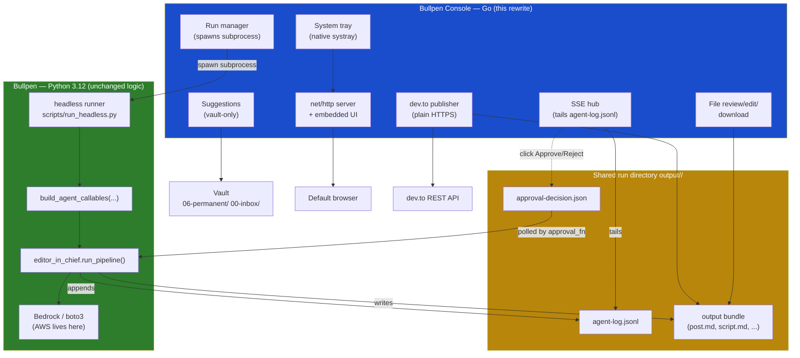
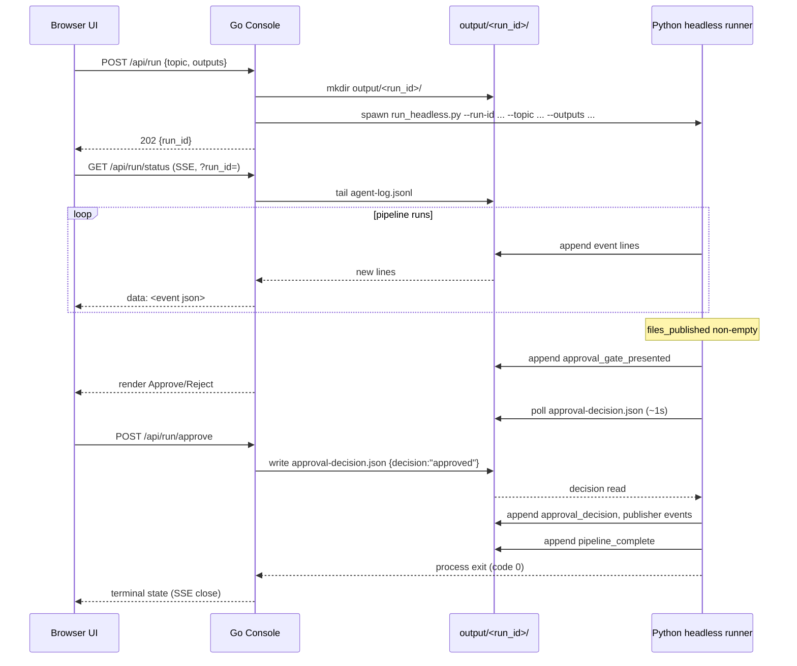
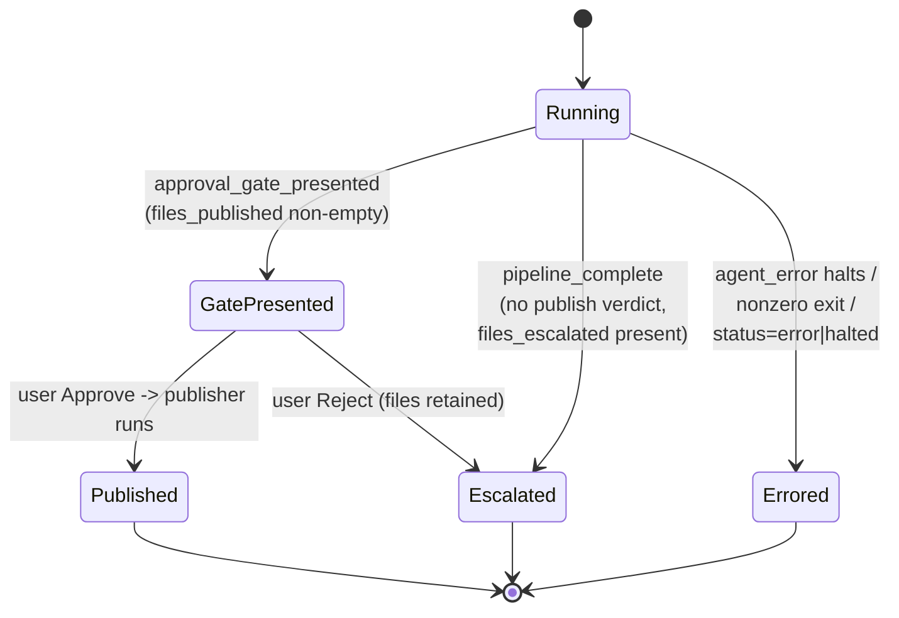
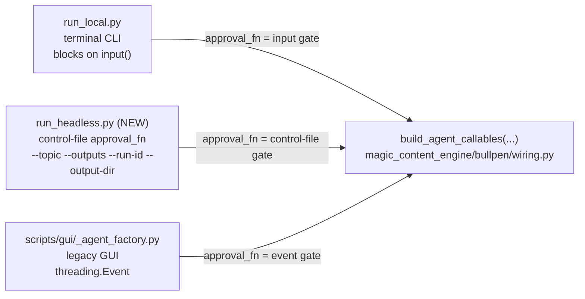

# Design Document: Bullpen Console (Go)

## Overview

The Bullpen Console is the local desktop shell that Mike operates the Bullpen
from. Today it is a Flask app under `scripts/gui/` booted by `bullpen.bat`,
and it has been a recurring source of friction: port 5000 conflicts, Python
Environment Tools crashes from stale worktrees, venv fragility, and SSE
streaming bugs. This design rewrites only the Console in Go. The **Bullpen**
(the Python newsroom of agents under `magic_content_engine/bullpen/`) stays
Python 3.12 with boto3/Bedrock and is untouched in its editorial logic.

The two layers integrate through a **shared run directory** (`output/<run_id>/`).
Per [ADR-0001](../../../docs/adr/0001-go-console-spawns-python-bullpen.md), the
Go Console spawns a **headless Python runner** as a subprocess once per Run
(Option A), tails the `agent-log.jsonl` event stream the runner already writes,
and signals the approval gate by writing an **approval decision file** into the
run directory that the Python `approval_fn` polls for. No long-lived Python
sidecar, no FFI, and no AWS SDK in Go. AWS stays entirely on the Python side;
the Console needs no AWS credentials to boot.

This design conforms to the locked decisions in `CONTEXT.md` and ADR-0001 and
does not re-litigate them. It covers the Console/Bullpen process boundary, the
file/data contracts between them, the control-file approval protocol, the SSE
event contract (including the reconnect-dedup fix), the shared
`build_agent_callables(...)` wiring factory the Python side must expose, and the
Go package layout. The legacy Flask Console is kept alive in parallel until the
Go Console proves itself over several real Runs; deletion is a follow-up.

---

## Architecture

### Layer boundary



The contract between the two layers is **files in `output/<run_id>/`**, the same
contract the pipeline already produces. The Console writes one new file
(`approval-decision.json`); the Bullpen writes everything else. Nothing crosses
the boundary except files and the subprocess lifecycle (spawn, stdout/stderr,
exit code).

### Process model (Option A — subprocess per Run)



The Console treats the subprocess exit code and the terminal `pipeline_complete`
event as two independent completion signals and reconciles them (see Error
Handling). One Run is active at a time, matching the current Flask single
`RunState` model.

### Terminal states

The Console must visibly distinguish three terminal states. Pipeline behaviour
for the no-publish-verdict case is **unchanged from today** — the gate only
fires when `files_published` is non-empty. The Console is responsible for
explaining the outcome, not for changing pipeline logic.



| Terminal state | Trigger | Console presentation |
|---|---|---|
| **Gate presented** | `approval_gate_presented` event seen; at least one `publish` verdict | Approve / Reject buttons, list of files pending approval |
| **Escalated** | `pipeline_complete` with no publish verdict; `file_escalated` events seen | No gate; clear "held for manual review" message listing escalated files and why |
| **Errored / halted** | `agent_error` that halts, `pipeline_complete` with `status` of `error`/`halted`, or nonzero subprocess exit | Error banner with the failing step and message |

---

## Components and Interfaces

All components live inside the Go Console. The Bullpen side contributes only the
headless runner entry point and the shared factory (see Shared Wiring Factory).

### Component 1: Run Manager (`internal/run`)

**Purpose**: Owns the lifecycle of a single Run — spawns the Python headless
runner, tracks the active run, exposes status, and bridges approval clicks to
the decision file.

**Interface**:

```go
// RunManager owns the single active Run and its subprocess.
type RunManager interface {
    // Start spawns the headless Python runner for a new Run.
    // Returns ErrRunInProgress if a Run is already active.
    Start(ctx context.Context, req StartRequest) (RunHandle, error)

    // Active returns the current RunHandle, or ok=false if none.
    Active() (RunHandle, bool)

    // Decide writes the approval decision file. Returns ErrNoGate if the
    // pipeline is not currently awaiting an approval decision.
    Decide(runID string, approved bool) error
}

type StartRequest struct {
    Topic   string   // free-text, required, non-empty
    Outputs []string // subset of {blog,youtube,cfp,usergroup,digest} or ["all"]
}

type RunHandle struct {
    RunID     string
    OutputDir string    // absolute path to output/<run_id>/
    LogPath   string    // OutputDir/agent-log.jsonl
    StartedAt time.Time
    cmd       *exec.Cmd // headless runner subprocess
}
```

**Responsibilities**:
- Generate `run_id`, create `output/<run_id>/`, spawn the runner with
  `--run-id`, `--topic`, `--outputs`, `--output-dir`.
- Enforce single-active-run (replaces Flask `_run_lock` + `RunState`).
- Capture subprocess stdout/stderr to `output/<run_id>/runner.stderr.log` for
  diagnosis (the runner is otherwise silent except `agent-log.jsonl`).
- Reconcile subprocess exit with the terminal event.

### Component 2: HTTP Server + Router (`internal/server`)

**Purpose**: Reproduce the Flask Console API surface using `net/http` only.

**Interface**:

```go
type Server struct {
    runs   RunManager
    sse    *SSEHub
    files  FileService
    vault  SuggestionService
    devto  DevtoPublisher
    static fs.FS // embedded UI assets
}

func (s *Server) Routes() http.Handler // returns *http.ServeMux
```

**Endpoints** (parity with `scripts/gui/app.py`):

| Method + path | Purpose | Notes |
|---|---|---|
| `POST /api/run` | Start a Run | 202 `{run_id}`; 409 if in progress; 422 on validation |
| `GET /api/run/status` | SSE log tail | `?run_id=` selects the run dir; replay + dedup |
| `POST /api/run/approve` | Approve gate | Writes decision file; 409 if no gate |
| `POST /api/run/reject` | Reject gate | Writes decision file; 409 if no gate |
| `GET /api/runs` | List runs | Walks `output/` one level deep |
| `GET /api/runs/{id}/file?name=` | Read file | Path-traversal guarded |
| `POST /api/runs/{id}/file` | Save file | Atomic temp-write + rename |
| `GET /api/runs/{id}/download/{file}` | Download file | `Content-Disposition: attachment` |
| `GET /api/suggestions` | Vault recency list | Vault-only, no AWS |
| `GET /api/suggestions/search?q=` | **NEW** title search | Filter over all vault notes |
| `POST /api/publish/devto` | Publish to dev.to | Plain HTTPS, handles nested `post.md` |
| `GET /api/health` | Health check | `{"status":"ok"}` |
| `GET /` and `/static/...` | Embedded UI | `embed.FS` |

**Responsibilities**:
- Validate request bodies, return the same JSON error shape as Flask
  (`{"error": <code>, "detail": <msg>}`).
- Bind to `127.0.0.1` only (single machine, never network-exposed). No
  authentication is added because the listener is loopback-only; this is called
  out explicitly so it is a conscious decision, not an oversight.

### Component 3: SSE Hub (`internal/sse`)

**Purpose**: Tail `output/<run_id>/agent-log.jsonl` and stream each event as an
SSE frame, with replay-on-connect and **deduplication so replayed events on
reconnect never double-render** (the bug fixed late in the Flask version that
the Go version must get right from the start).

**Interface**:

```go
type SSEHub struct{}

// Stream tails logPath and writes SSE frames to w until the client
// disconnects (ctx cancelled) or the run reaches a terminal event.
func (h *SSEHub) Stream(ctx context.Context, w http.ResponseWriter, logPath string, isActive func() bool) error

// LogEvent is one line of agent-log.jsonl.
type LogEvent struct {
    EventType string                 `json:"event_type"`
    Timestamp string                 `json:"timestamp"` // ISO 8601
    AgentType string                 `json:"agent_type"`
    RunID     string                 `json:"run_id"`
    Details   map[string]any         `json:"details"`
}

// DedupKey is the identity used to suppress duplicate renders.
func (e LogEvent) DedupKey() string {
    return e.Timestamp + "|" + e.EventType + "|" + e.AgentType
}
```

**Responsibilities**:
- Open the file from offset 0 on connect so a browser refresh replays the full
  history (matches current `_tail_log` seek-to-0 behaviour).
- Maintain an in-memory `seen map[string]struct{}` per stream keyed by
  `DedupKey()`; skip emitting any event whose key was already sent.
- Poll for new lines roughly every second; emit a synthetic terminal frame when
  `isActive()` is false and the file is idle.
- Close cleanly on client disconnect (`ctx.Done()`), the Go equivalent of the
  Flask `GeneratorExit` handling.

### Component 4: File Service (`internal/files`)

**Purpose**: Back the run-bundle file API — list, read, atomic save, download —
with path-traversal protection and one-level-deep subdirectory support.

**Interface**:

```go
type FileService interface {
    ListRuns() ([]RunListing, error)                 // walks output/ one level deep
    ReadFile(runID, name string) ([]byte, error)      // name may be "subdir/file.md"
    SaveFile(runID, name string, content []byte) error// atomic temp + rename
    ResolveDownload(runID, name string) (string, error)
}

type RunListing struct {
    ID    string   `json:"id"`
    Files []string `json:"files"` // excludes agent-log.jsonl, checkpoints.json
}
```

**Responsibilities**:
- Reproduce `_safe_file_path`: resolve the candidate path and confirm it is
  inside the run dir; reject traversal with 403.
- Reproduce `/api/runs` walk: files directly in the run dir plus one level of
  subdirectories, stored as `subdir/filename` so they round-trip through the
  file API. Exclude `agent-log.jsonl` and `checkpoints.json`.
- Atomic save: write to a temp file in the same directory, then `os.Rename`
  over the target (matches the Flask `mkstemp` + `os.replace`).

### Component 5: Suggestion Service (`internal/vault`)

**Purpose**: Vault-only topic suggestions. **The DynamoDB fallback is dropped.**
Two capabilities: a recency list and a NEW title search. The topic field is
always free-text; suggestions only pre-fill it.

**Interface**:

```go
type SuggestionService interface {
    // Recency returns most-recently-modified notes from 06-permanent/ and
    // 00-inbox/ by mtime (vault-only, no AWS).
    Recency(limit int) ([]Suggestion, error)

    // Search filters note titles across ALL vault notes by query substring.
    Search(query string, limit int) ([]Suggestion, error)
}

type Suggestion struct {
    Topic       string `json:"topic"`
    LastCovered string `json:"last_covered"` // ISO date from mtime
    DaysSince   int    `json:"days_since"`
    Source      string `json:"source"`       // path relative to vault root
}
```

**Responsibilities**:
- Read `VAULT_PATH` at call time (env, default to the current Flask default).
- Recency: glob `06-permanent/*.md` then `00-inbox/*.md`, sort by mtime desc,
  derive topic from the permanent-note filename (stripping a leading numeric ID)
  or the inbox note's first `# ` heading, dedup by lowercased topic.
- Search: walk all `*.md` under the vault, match `query` against the derived
  title case-insensitively, cap results.
- Never touch AWS. If the vault path is missing, return an empty list with a
  warning field rather than erroring.

### Component 6: dev.to Publisher (`internal/devto`)

**Purpose**: Publish a Run's `post.md` to dev.to over plain HTTPS. No AWS.

**Interface**:

```go
type DevtoPublisher interface {
    // Publish locates post.md for runID, POSTs to dev.to, returns the result.
    Publish(runID string, req DevtoRequest) (DevtoResult, error)
}

type DevtoRequest struct {
    Title     string   `json:"title"`
    Tags      []string `json:"tags"`
    Published bool     `json:"published"`
}

type DevtoResult struct {
    Success    bool   `json:"success"`
    URL        string `json:"url,omitempty"`
    ID         int    `json:"id,omitempty"`
    StatusCode int    `json:"status_code,omitempty"`
    Error      string `json:"error,omitempty"`
}
```

**Responsibilities**:
- Locate `post.md` at `output/<run_id>/post.md` **or** the nested
  `output/<run_id>/<date-slug>/post.md` (reproduce `_find_post_md`).
- POST to `https://dev.to/api/articles` with header `api-key: <DEVTO_API_KEY>`
  and body `{"article": {title, body_markdown, tags, published}}`.
- Map HTTP 201 to `{success:true, url, id}`; non-201 to
  `{success:false, status_code, error}`; network failure to
  `{success:false, error}`. Mirrors the Python `devto_client`.

### Component 7: Tray + Port + Browser (`internal/desktop`)

**Purpose**: Native replacements for pystray, the `netstat`/`taskkill` dance in
`bullpen.bat`, and `webbrowser`.

**Interface**:

```go
type Desktop interface {
    RunTray(onOpen func(), onQuit func()) // blocks; systray main loop
    OpenBrowser(url string) error
}

// PickPort returns a free loopback port, preferring `preferred`, falling back
// to an OS-assigned port if it is taken. Replaces netstat/taskkill.
func PickPort(preferred int) (int, error)
```

**Responsibilities**:
- System tray with "Open Bullpen" (default) and "Quit", using a native Go
  systray library (e.g. `fyne.io/systray`).
- Native port handling: try the preferred port; if taken, bind `:0` and let the
  OS assign a free port, then report the chosen URL. No killing of other
  processes.
- Native browser launch via the OS opener (`rundll32 url.dll` / `start` on
  Windows), wrapped in the `Desktop` interface.

---

## Data Models

### Run directory layout (the integration contract)

```
output/<run_id>/
├── agent-log.jsonl          # Bullpen writes (append-only); Console tails
├── approval-decision.json   # Console writes; Bullpen polls/reads/deletes
├── checkpoints.json         # Bullpen writes; Console ignores
├── runner.stderr.log        # Console writes (captured subprocess stderr)
└── <date>-<slug>/           # output bundle (may also be flat in <run_id>/)
    ├── post.md
    ├── script.md
    └── digest-email.txt
```

### LogEvent (mirrors Python `AMILogEvent`)

```go
type LogEvent struct {
    EventType string         `json:"event_type"`
    Timestamp string         `json:"timestamp"` // ISO 8601
    AgentType string         `json:"agent_type"`
    RunID     string         `json:"run_id"`
    Details   map[string]any `json:"details"`
}
```

**Observed `event_type` values** (from the real pipeline in `editor_in_chief.py`):

| `event_type` | Emitting agent(s) | Key `details` fields | Console meaning |
|---|---|---|---|
| `agent_invoked` | researcher, desk_editor, writer, subeditor, publisher | `topic` / `output_types` / `cycle` / `files` | step started |
| `agent_completed` | same set | `output_hash`, counts, `files_published` (publisher) | step finished |
| `agent_error` | any | `step`, `error` | step failed (may halt) |
| `verdict` | subeditor | `filename`, `verdict` (`publish`/`revise`/`spike`), `feedback`, `cycle` | per-file judgement |
| `approval_gate_presented` | editor_in_chief | `files_pending_approval` | **enter Gate-presented state** |
| `approval_decision` | editor_in_chief | `approved`, `files` | gate resolved |
| `approval_rejected` | editor_in_chief | `files_retained` | rejected -> escalate |
| `file_escalated` | subeditor, writer | `filename`, `reason` | held for manual review |
| `pipeline_complete` | editor_in_chief (synthetic on error too) | `status`, optional `error`, `traceback` | **terminal** |

The Console treats this list as the closed set it understands, but must render
unknown `event_type` values gracefully (show raw) rather than dropping them, so
new Bullpen events do not silently disappear.

### ApprovalDecision (the new control file)

```go
type ApprovalDecision struct {
    Decision  string `json:"decision"`  // "approved" | "rejected"
    DecidedAt string `json:"decided_at"`// ISO 8601, set by Console
    RunID     string `json:"run_id"`
}
```

**Validation rules**:
- `Decision` is exactly `"approved"` or `"rejected"`.
- `RunID` must equal the active run's id.
- Written atomically (temp file + rename) so the Python poller never reads a
  half-written file.

---

## Control-File Protocol (Low-Level)

This is the precise cross-process approval contract that replaces the in-process
`threading.Event` used by the Flask Console's `pipeline_runner._make_approval_fn`.

### Filename and location

- Path: `output/<run_id>/approval-decision.json` (in the shared run directory,
  same family as `agent-log.jsonl`).
- A transient sibling `output/<run_id>/approval-decision.json.tmp` is used only
  during atomic writes and is renamed into place; the poller never reads `.tmp`.

### Who writes / reads / deletes

| Actor | Action | When |
|---|---|---|
| **Bullpen** (`approval_fn`) | ensures no stale file exists, then **polls** for `approval-decision.json` | when `files_published` is non-empty and the gate is reached |
| **Console** (`POST /approve` or `/reject`) | **writes** `approval-decision.json` atomically | when Mike clicks |
| **Bullpen** (`approval_fn`) | **reads** the decision, then **deletes** the file | once a valid decision is seen |

The Bullpen owns deletion (read-and-delete) so a decision from a previous gate
can never be mistaken for the current one. The Console never deletes it.

### Control-file approval_fn (Structured Pseudocode)

```pascal
PROCEDURE control_file_approval_fn(sub_review)
  INPUT:  sub_review (SubeditorReview or NULL)
  OUTPUT: approved (boolean)

  decision_path  ← run_dir / "approval-decision.json"
  POLL_INTERVAL  ← 1 second   // ~1s latency acceptable per ADR-0001

  SEQUENCE
    // Pre-clean: a leftover file from an earlier gate must not be honoured.
    IF exists(decision_path) THEN
      delete(decision_path)
    END IF

    // The approval_gate_presented event has already been logged by the
    // Editor-in-Chief, so the Console knows to show Approve/Reject.

    WHILE true DO
      IF exists(decision_path) THEN
        TRY
          data ← read_json(decision_path)
        CATCH partial_or_invalid_json
          // Writer not finished (should not happen with atomic rename);
          // wait and retry rather than crash.
          SLEEP POLL_INTERVAL
          CONTINUE
        END TRY

        delete(decision_path)            // consume the decision

        IF data.decision = "approved" THEN
          RETURN true
        ELSE IF data.decision = "rejected" THEN
          RETURN false
        ELSE
          // Unknown value — ignore and keep polling.
          SLEEP POLL_INTERVAL
          CONTINUE
        END IF
      END IF

      SLEEP POLL_INTERVAL
    END WHILE
  END SEQUENCE
END PROCEDURE
```

**Preconditions**:
- The run directory exists and is writable by both processes.
- The gate is only reached when `files_published` is non-empty (pipeline
  behaviour unchanged from today).

**Postconditions**:
- Returns `true` for an `approved` decision, `false` for `rejected`.
- The decision file is deleted before returning, so the next gate starts clean.

**Loop invariant**:
- At the top of each `WHILE` iteration, no honoured decision has yet been read;
  the only way to exit is to read and consume a valid decision.

### Console-side write (Go)

```go
// Decide writes the approval decision atomically into the run directory.
func (m *runManager) Decide(runID string, approved bool) error {
    h, ok := m.Active()
    if !ok || h.RunID != runID {
        return ErrNoGate
    }
    if !m.awaitingGate.Load() { // set when approval_gate_presented is seen
        return ErrNoGate         // -> HTTP 409, matches Flask behaviour
    }
    decision := "rejected"
    if approved {
        decision = "approved"
    }
    payload, _ := json.Marshal(ApprovalDecision{
        Decision:  decision,
        DecidedAt: time.Now().UTC().Format(time.RFC3339),
        RunID:     runID,
    })
    return atomicWriteFile(
        filepath.Join(h.OutputDir, "approval-decision.json"),
        payload,
    )
}

// atomicWriteFile writes to a .tmp sibling then renames, so the Python poller
// never observes a partial file.
func atomicWriteFile(path string, data []byte) error {
    tmp := path + ".tmp"
    if err := os.WriteFile(tmp, data, 0o644); err != nil {
        return err
    }
    return os.Rename(tmp, path)
}
```

### Race handling

- **Partial read**: prevented by atomic temp-write + rename on the Console side;
  the poller only ever sees a fully written file. The poller still defends with
  a try/retry on JSON parse failure.
- **Stale decision**: prevented by the pre-clean delete at gate entry and the
  read-and-delete on consume. A decision file only ever corresponds to the
  current gate.
- **Double click / double POST**: the second write overwrites the first before
  the poller reads, or the poller has already consumed and deleted the file so
  the second write lands after the gate closed and is cleaned at the next gate
  entry (or ignored at completion). The Console also guards with
  `awaitingGate` so a click with no active gate returns 409.
- **Crash mid-gate**: if the runner dies while polling, the subprocess exit is
  detected by the Run Manager and the Run transitions to Errored; any leftover
  decision file is irrelevant because the next Run uses a new `run_id`
  directory.

---

## SSE Contract (Low-Level)

### Wire format

The endpoint `GET /api/run/status?run_id=<id>` responds with
`Content-Type: text/event-stream`, `Cache-Control: no-cache`,
`X-Accel-Buffering: no`. Each `agent-log.jsonl` line is emitted as:

```
data: {"event_type":"agent_completed","timestamp":"2026-06-02T...","agent_type":"writer","run_id":"...","details":{...}}

```

A terminal frame is emitted when the run is no longer active and the file is
idle:

```
event: pipeline_complete
data: {"status":"complete"}

```

### Replay + dedup (the bug to get right from the start)

On every connect (including browser refresh and EventSource auto-reconnect) the
server replays from file offset 0 so the UI can rebuild the full timeline. To
ensure **replayed events never double-render**, both server and client dedup by
the same key: `timestamp | event_type | agent_type`.

```pascal
PROCEDURE stream_sse(log_path, is_active, writer)
  INPUT:  log_path, is_active (callback), writer (HTTP response)
  OUTPUT: none (streams until disconnect or terminal)

  SEQUENCE
    seen        ← empty set        // dedup keys already emitted
    offset      ← 0                // replay from start of file
    idle_ticks  ← 0

    WHILE client_connected(writer) DO
      lines, offset ← read_new_lines(log_path, offset)

      IF lines is empty THEN
        SLEEP 1 second
        IF NOT is_active() THEN
          idle_ticks ← idle_ticks + 1
          IF idle_ticks ≥ 2 THEN
            emit(writer, "event: pipeline_complete\ndata: {\"status\":\"complete\"}")
            RETURN
          END IF
        END IF
        CONTINUE
      END IF

      idle_ticks ← 0
      FOR each line IN lines DO
        event ← parse_json(line)
        key   ← event.timestamp + "|" + event.event_type + "|" + event.agent_type

        IF key IN seen THEN
          CONTINUE                 // suppress duplicate render
        END IF
        seen ← seen ∪ {key}

        emit(writer, "data: " + line)
      END FOR
    END WHILE
  END SEQUENCE
END PROCEDURE
```

**Preconditions**: `log_path` exists (the Console `touch`es it before streaming,
matching the Flask tailer).

**Postconditions**: every distinct event is emitted exactly once per stream;
the stream ends with a single terminal frame or on client disconnect.

**Loop invariant**: `seen` contains exactly the dedup keys already written to
this client; no key in `seen` is ever emitted again.

The client mirrors the same `seen` set keyed identically, so even if the server
and client disagree about offsets across a reconnect, the UI still renders each
event once. Belt and braces, because this is the exact failure that bit the
Flask version.

---

## Shared Wiring Factory (Low-Level, Python side)

The triplicated agent wiring currently duplicated across `scripts/run_local.py`
and `scripts/gui/_agent_factory.py` is extracted into **one**
`build_agent_callables(...)` factory, parameterised by which `approval_fn` to
use. Three thin entry points consume it. This refactor touches working Python
and **must keep the existing pipeline tests green**.

### Factory signature

```python
# magic_content_engine/bullpen/wiring.py  (new shared module)

def build_agent_callables(
    *,
    brief: BullpenBrief,
    output_dir: str,
    approval_fn: Callable[[SubeditorReview | None], bool],
    github_token: str | None = None,
    dry_run: bool = False,
) -> dict[str, Callable]:
    """Build every agent callable for run_pipeline(), in one place.

    Returns a dict ready for **kwargs unpacking into run_pipeline():
        researcher_fn, desk_editor_fn, writer_fn, subeditor_fn,
        publisher_fn, approval_fn, log_fn, checkpoint_fn

    Parameterised by approval_fn so each entry point supplies its own gate:
      - terminal CLI       -> blocking input() gate
      - headless runner    -> control-file gate (polls approval-decision.json)
      - legacy GUI         -> threading.Event gate
    """
```

The factory keeps the existing AWS-backed callables (Bedrock LLM, DynamoDB
log/checkpoint, S3/SES publisher) exactly as they are today. AWS stays on the
Python side; nothing here changes the inference backend or the DynamoDB
run-history/checkpoint writes used by Runs.

### Three entry points



| Entry point | `approval_fn` supplied | I/O behaviour |
|---|---|---|
| `scripts/run_local.py` (terminal CLI) | blocking `input()` gate (existing) | interactive terminal |
| `scripts/run_headless.py` (**NEW**, spawned by Console) | control-file gate (polls `approval-decision.json`) | **silent except `agent-log.jsonl`**; args `--topic`, `--outputs`, `--run-id`, `--output-dir` |
| `scripts/gui/_agent_factory.py` (legacy GUI) | `threading.Event` gate (existing) | kept alive in parallel |

### Headless runner (the spawn target)

```python
# scripts/run_headless.py  (NEW — silent, control-file gate)

def main(argv=None) -> int:
    args = parse_args(argv)  # --topic --outputs --run-id --output-dir
    brief = BullpenBrief(topic=args.topic, requested_outputs=args.outputs)

    approval_fn = make_control_file_approval_fn(
        run_dir=Path(args.output_dir) / args.run_id,
    )
    callables = build_agent_callables(
        brief=brief,
        output_dir=str(Path(args.output_dir) / args.run_id),
        approval_fn=approval_fn,
        github_token=os.getenv("GITHUB_TOKEN"),
    )
    result = run_pipeline(brief=brief, **callables)

    # The pipeline already logs pipeline_complete via log_fn; on an unhandled
    # crash the runner writes a synthetic pipeline_complete(status=error)
    # so the Console's tail always sees a terminal event.
    return 0 if result.status == "success" else 1
```

The headless runner emits nothing to stdout in normal operation; the Console
observes progress solely through `agent-log.jsonl` and the exit code. Any stderr
is captured by the Console to `runner.stderr.log` for diagnosis.

---

## Go Package Layout

Standard-library-first. The only non-stdlib dependency is a system-tray library.

```
cmd/
  bullpen-console/
    main.go            # wire deps, pick port, start server, run tray, open browser

internal/
  server/
    server.go          # net/http mux, handlers, JSON error shape
    server_test.go
  run/
    manager.go         # spawn headless runner, single-active-run, Decide()
    decision.go        # ApprovalDecision, atomic write
    manager_test.go
  sse/
    hub.go             # tail + replay + dedup (timestamp|event_type|agent_type)
    event.go           # LogEvent, DedupKey()
    hub_test.go
  files/
    service.go         # list/read/save/download, path-traversal guard
    service_test.go
  vault/
    suggest.go         # recency list + NEW title search, vault-only
    suggest_test.go
  devto/
    client.go          # plain HTTPS POST, nested post.md resolution
    client_test.go
  desktop/
    tray.go            # native systray (fyne.io/systray)
    port.go            # PickPort — native port handling (replaces netstat/taskkill)
    browser.go         # native browser launch

web/
  static/              # embedded via embed.FS (index.html, css, js, bullpen-logo.svg)
  embed.go             # //go:embed static/*

go.mod                 # module + single systray dependency
```

**Layout rationale**:
- `cmd/bullpen-console` is the single binary entry point that replaces
  `run_gui.py` + `bullpen.bat`.
- `internal/` keeps the Console packages unexported and cohesive, one package
  per responsibility from the components above.
- `web/` holds the UI assets embedded with `embed.FS` so the binary is
  self-contained (single-machine scope; no asset path fragility).
- Tests sit beside each package. The build/test command is `go test ./...`.

---

## Correctness Properties

These are the invariants the implementation must uphold, stated as universal
quantification over the relevant inputs. They map directly to the property-based
tests in the Testing Strategy.

### Property 1: SSE renders each event exactly once (the reconnect-dedup fix)

For all sequences of log lines `L` and all partitions of the connect timeline
into sessions `S1..Sn` (replays), the multiset of events rendered by the
client equals the set of distinct events in `L` keyed by
`timestamp | event_type | agent_type`. No event is rendered twice; none is
dropped.
> ∀ L, ∀ partition into reconnect sessions: rendered(L) = distinct(L) by DedupKey

**Validates: Requirements 1.1** (SSE streaming and reconnect dedup)

### Property 2: Approval decision round-trips and self-cleans

For all `d ∈ {approved, rejected}`, an atomic Console write of `d` followed by
the Bullpen poller's read-and-delete returns `d == approved` as the boolean
and leaves no `approval-decision.json` in the run directory.
> ∀ d ∈ {approved, rejected}: poll(write(d)) = (d = approved) ∧ ¬exists(decision_file)

**Validates: Requirements 2.1** (cross-process approval gate)

### Property 3: The gate fires if and only if there is a publish verdict

For all Runs, `approval_gate_presented` is emitted ⟺ `files_published` is
non-empty. (Pipeline behaviour unchanged from today; the Console only
reflects it.)
> ∀ run: gate_presented(run) ⟺ files_published(run) ≠ ∅

**Validates: Requirements 3.1** (terminal states — gate vs escalation)

### Property 4: Exactly one terminal state is shown

For all Runs, the Console settles into exactly one of {Gate presented,
Escalated, Errored} and renders a single terminal frame.
> ∀ run: |{gate_presented, escalated, errored} observed as terminal| = 1

**Validates: Requirements 3.2** (three distinguishable terminal states)

### Property 5: File access never escapes the run directory

For all `run_id` and all `name`, a resolved file path is either inside
`output/<run_id>/` or the request is rejected.
> ∀ run_id, name: resolve(run_id, name) ⊆ output/<run_id>/  ∨  rejected

**Validates: Requirements 4.1** (file review/edit/download safety)

### Property 6: The Console boots with no AWS

For all environments lacking AWS credentials and SDK, the Console starts,
serves the UI, and lists runs successfully. AWS is required only to execute a
Run (Python side), never to boot the shell.
> ∀ env without AWS: console.boot() = ok

**Validates: Requirements 5.1** (no AWS in the Console)

### Property 7: Suggestions are vault-only

For all suggestion requests, no AWS call is made; results derive solely from
the vault filesystem (recency by mtime, or title search).
> ∀ request: aws_calls(suggestions) = ∅

**Validates: Requirements 6.1** (vault-only suggestions + title search)

> Note: requirement numbers above are forward references. This is the
> design-first workflow; the requirements document is derived from this design
> next and will be numbered to match these references.

---

## Error Handling

### Scenario 1: Headless runner fails to spawn

**Condition**: Python missing, bad args, or working directory wrong.
**Response**: `POST /api/run` returns 500 with `{"error":"spawn_failed","detail":...}`;
no `run_id` is returned and no run is marked active.
**Recovery**: Mike fixes the Python environment; the Console itself did not need
Python to boot, so the shell stays up.

### Scenario 2: Runner crashes mid-pipeline

**Condition**: unhandled exception in the Python pipeline.
**Response**: the runner writes a synthetic `pipeline_complete` with
`status:"error"` (and `traceback`) to `agent-log.jsonl`; the subprocess exits
nonzero. The Console tail emits the terminal frame and shows the Errored state.
**Recovery**: `runner.stderr.log` holds the captured traceback for diagnosis.

### Scenario 3: Exit/terminal-event mismatch

**Condition**: subprocess exits before a `pipeline_complete` line is flushed, or
a terminal event arrives but the process lingers.
**Response**: the Run Manager reconciles the two — whichever arrives first marks
the Run terminal; if the process exits nonzero with no terminal event, the
Console synthesises an Errored terminal frame so the UI never hangs.
**Recovery**: state is derived from files, so a refreshed browser replays the
final timeline.

### Scenario 4: Approve/Reject with no active gate

**Condition**: click arrives when the pipeline is not awaiting a decision.
**Response**: 409 `{"error":"conflict","detail":"No approval gate is currently waiting."}`,
matching the Flask behaviour.
**Recovery**: none needed; the UI only shows the buttons in the Gate-presented
state.

### Scenario 5: Path traversal on file API

**Condition**: `name` escapes the run directory.
**Response**: 403 `{"error":"forbidden","detail":"path traversal detected"}`.
**Recovery**: none; request rejected.

### Scenario 6: Port in use

**Condition**: preferred port already bound.
**Response**: `PickPort` falls back to an OS-assigned free port; the Console
opens the browser at the actual chosen URL. No process is killed (a deliberate
departure from the `netstat`/`taskkill` approach in `bullpen.bat`).
**Recovery**: automatic.

### Scenario 7: Vault missing / dev.to failure

**Condition**: `VAULT_PATH` not present, or dev.to returns non-201.
**Response**: suggestions return an empty list with a `warning`; dev.to maps the
upstream error into `{success:false, status_code, error}` and the endpoint
returns 502.
**Recovery**: Mike corrects the path or retries publish; neither blocks Runs.

---

## Testing Strategy

### Unit testing approach

`go test ./...`, table-driven where natural. Priority cases:
- **SSE dedup**: feed a log with duplicate lines and a simulated reconnect;
  assert each `DedupKey()` is emitted exactly once. This is the regression guard
  for the known Flask bug.
- **Control-file write**: assert `Decide` writes valid JSON atomically and
  returns `ErrNoGate` when no gate is active.
- **File service**: path-traversal rejection, one-level-deep subdir listing,
  atomic save round-trip, exclusion of `agent-log.jsonl`/`checkpoints.json`.
- **Vault**: recency ordering by mtime, title-search filtering, empty-vault
  graceful path.
- **dev.to**: nested vs flat `post.md` resolution; 201/non-201/network mapping
  using an `httptest.Server`.
- **Run manager**: single-active-run enforcement (409), spawn-failure path.

### Property-based testing approach

**Property test library**: Go standard `testing/quick` (stdlib-first; reach for
`pgregory.net/rapid` only if richer generators are needed).

Candidate properties:
- **SSE idempotence**: for any sequence of log lines and any partition into two
  connect sessions (replay), the multiset of distinct events the client renders
  equals the set of distinct events in the file. No event rendered twice, none
  dropped.
- **Approval round-trip**: for any `decision in {approved, rejected}`, an atomic
  write followed by the poller's read-and-delete yields the matching boolean and
  leaves no decision file behind.
- **Path-traversal safety**: for any `name`, `ReadFile`/`SaveFile` either
  resolve inside the run directory or are rejected — never escape it.

### Cross-process integration testing

- **Control-file gate end-to-end**: a fake "runner" that writes a known
  `agent-log.jsonl` and runs the real `control_file_approval_fn` against a temp
  run dir, while the Go `Decide` writes the decision. Assert the gate resolves
  with ~1s latency and the file is consumed.
- **Python pipeline tests stay green**: the `build_agent_callables(...)`
  extraction must not change observable behaviour. Run the existing Hypothesis
  and pipeline suites (`pytest`) before and after the refactor and require no
  diffs in outcomes. The three entry points are validated to produce equivalent
  wiring (same callable set, only `approval_fn` differs).

---

## Security Considerations

- **Loopback only**: the HTTP server binds `127.0.0.1`. It is never network
  exposed, so no authentication layer is added. This is stated explicitly so the
  absence of auth is a conscious, scoped decision rather than an oversight. If
  the bind address ever changes, auth must be revisited.
- **No AWS in the Console**: the Go binary carries no AWS SDK and needs no AWS
  credentials to boot. Anything needing AWS is produced by the Python side as
  files in the run directory.
- **Path traversal**: all file endpoints resolve and confine paths to the run
  directory (`_safe_file_path` parity).
- **Secrets**: `DEVTO_API_KEY` is read from the environment and sent only to
  `dev.to` over HTTPS; it is never logged. `.env`, AWS creds, and the vault stay
  configured on Mike's main PC.
- **Subprocess args**: the runner is invoked with an argument vector (not a
  shell string), so the free-text topic cannot inject shell commands.

## Performance Considerations

- **Poll latency**: the approval gate polls about every 1 second; ~1s latency is
  acceptable for a human gate per ADR-0001.
- **Log tailing**: replay-from-zero on connect is acceptable for the modest
  `agent-log.jsonl` sizes a single Run produces; the dedup `seen` set bounds
  re-rendering, not re-reading. If logs ever grow large, an offset cache keyed
  by `run_id` is a future optimisation, out of scope now.
- **Single Run at a time**: matches today's model and keeps resource use
  predictable on one machine.

## Dependencies

**Go (Console)**:
- Go standard library: `net/http`, `embed`, `os/exec`, `encoding/json`,
  `html/template` (or static `embed.FS`), `testing`/`testing/quick`.
- One system-tray library (e.g. `fyne.io/systray`) for the native tray.

**Python (Bullpen, unchanged)**:
- Python 3.12 with `boto3`/Bedrock, the existing `magic_content_engine.bullpen`
  package, and the new `scripts/run_headless.py` entry point plus the shared
  `build_agent_callables(...)` factory.

**Out of scope** (locked): packaging/distribution to other PCs, AWS in the
Console, the DynamoDB suggestions fallback, content-aware suggestions, and
deletion of the legacy Flask Console.
