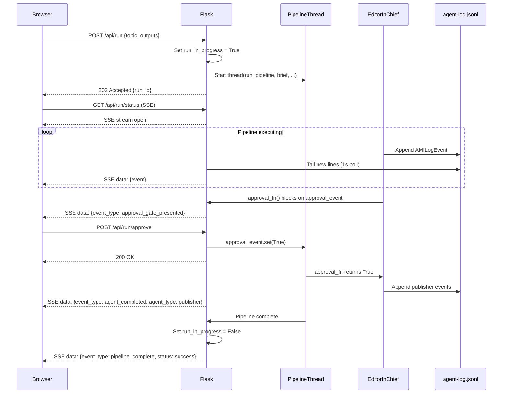

# Design Document — Bullpen Web GUI

## Overview

The Bullpen Web GUI is a local Flask application that wraps the existing
`run_pipeline()` function in a browser-based interface. It adds no new pipeline
logic — it is purely a web layer over the code already running in
`scripts/run_local.py`.

The server runs on `localhost:5000`. The frontend is plain HTML + vanilla
JavaScript (no build step, no npm). Server-Sent Events (SSE) stream pipeline
progress to the browser in real time. The approval gate is replaced by Approve /
Reject buttons that signal a `threading.Event` held by the background pipeline
thread.

All new code lives under `scripts/gui/`. The pipeline package
(`magic_content_engine/`) is not modified.

---

## Architecture

### Component Overview

```
Browser
  │  HTTP / SSE
  ▼
Flask app  (scripts/gui/app.py)
  ├── GET  /                     → serve index.html
  ├── GET  /api/suggestions      → DynamoDB topic coverage query
  ├── POST /api/run              → start pipeline in background thread
  ├── GET  /api/run/status       → SSE stream of AMILogEvents
  ├── POST /api/run/approve      → signal approval_event (True)
  ├── POST /api/run/reject       → signal approval_event (False)
  ├── GET  /api/runs             → list Run_Bundle directories
  ├── GET  /api/runs/<run>/files → list files in a Run_Bundle
  ├── GET  /api/runs/<run>/file  → read a file from a Run_Bundle
  ├── POST /api/runs/<run>/file  → save edited content to a Run_Bundle file
  ├── GET  /api/runs/<run>/download/<filename> → file download
  ├── POST /api/publish/devto    → publish or draft to dev.to
  └── Static assets              → scripts/gui/static/
```

### Request Flow — Pipeline Run



### Approval Gate — Threading Model

The approval gate in `run_local.py` uses `input()`. The GUI replaces this with
a `threading.Event` pair held in the Flask app's global run state:

```python
@dataclass
class RunState:
    in_progress: bool = False
    run_id: str = ""
    approval_event: threading.Event = field(default_factory=threading.Event)
    approval_result: bool = False
    log_path: Path | None = None
    output_dir: str = ""
```

The `approval_fn` passed to `run_pipeline()` blocks on `approval_event.wait()`,
then returns `approval_result`. The `/api/run/approve` and `/api/run/reject`
endpoints set `approval_result` and call `approval_event.set()`.

### SSE Log Tailing

The `/api/run/status` endpoint is a generator that:

1. Opens `output/agent-log.jsonl` and seeks to the end.
2. Polls for new lines every 1 second using `file.readline()`.
3. Yields each new line as an SSE `data:` frame.
4. Emits a synthetic `pipeline_complete` event when the pipeline thread exits.
5. Closes when the client disconnects.

This avoids WebSockets and works with Flask's built-in dev server and any
WSGI server that supports streaming responses.

---

## Components and Interfaces

### 1. Flask Application (`scripts/gui/app.py`)

Single-file Flask app. Uses only the standard library plus Flask and
`markdown-it-py` (new dependencies). All pipeline imports come from
`magic_content_engine/`.

**Global state** (module-level, protected by a `threading.Lock`):

```python
_run_state: RunState = RunState()
_run_lock: threading.Lock = threading.Lock()
```

**Key functions:**

```python
def _make_approval_fn(run_state: RunState) -> Callable[[SubeditorReview | None], bool]:
    """Return an approval_fn that blocks until the GUI signals approve/reject."""

def _tail_log(log_path: Path) -> Generator[str, None, None]:
    """Yield new JSON Lines from log_path as they are written."""

def _pipeline_thread(brief: BullpenBrief, output_dir: str, run_state: RunState) -> None:
    """Run run_pipeline() in a background thread, updating run_state on completion."""
```

### 2. API Endpoints

#### `POST /api/run`

Request body:
```json
{"topic": "Kiro IDE 1.0 launch", "outputs": ["blog", "youtube"], "dry_run": false}
```

Response (202):
```json
{"run_id": "2026-05-10-kiro-ide-1-0-launch", "output_dir": "output/2026-05-10-kiro-ide-1-0-launch"}
```

Error (409 — run already in progress):
```json
{"error": "conflict", "detail": "A pipeline run is already in progress."}
```

Error (422 — validation):
```json
{"error": "validation", "detail": "topic must be non-empty"}
```

#### `GET /api/run/status`

SSE stream. Each frame is a JSON-encoded `AMILogEvent` dict, plus two synthetic
events:

- `{"event_type": "pipeline_complete", "status": "success|halted|error", ...}`
- `{"event_type": "approval_gate_presented", ...}` (forwarded from log)

Content-Type: `text/event-stream`

#### `POST /api/run/approve` / `POST /api/run/reject`

No request body. Returns 200 if the approval gate is currently waiting, 409
otherwise.

#### `GET /api/runs`

Response:
```json
[
  {"run_id": "2026-05-10-weekly-update", "files": ["post.md", "script.md"]},
  {"run_id": "2026-05-09-weekly-update", "files": ["post.md"]}
]
```

Sorted by directory name descending. Excludes `agent-log.jsonl` and
`checkpoints.json` from the `files` list (those are internal).

#### `GET /api/runs/<run_id>/file?name=post.md`

Returns the raw file content as `text/plain; charset=utf-8`.

#### `POST /api/runs/<run_id>/file`

Request body:
```json
{"name": "post.md", "content": "# My post\n\n..."}
```

Writes atomically (temp file + rename). Returns 200 on success.

#### `GET /api/runs/<run_id>/download/<filename>`

Serves the file with `Content-Disposition: attachment; filename=<filename>`.

#### `POST /api/publish/devto`

Request body:
```json
{
  "run_id": "2026-05-10-weekly-update",
  "title": "Building a content pipeline with Kiro IDE",
  "tags": ["aws", "kiro", "ai", "buildinpublic"],
  "published": true
}
```

Reads `post.md` from the run bundle, POSTs to `https://dev.to/api/articles`.
Returns the dev.to response body on success, or a structured error on failure.

#### `GET /api/suggestions`

Queries DynamoDB `mce-topic-coverage`. Returns up to 10 topics not covered in
the last 30 days, ordered by days-since-last-coverage descending.

Response:
```json
[
  {"topic": "AgentCore GA", "last_covered": null, "days_since": null},
  {"topic": "Strands SDK update", "last_covered": "2026-03-01", "days_since": 70}
]
```

On DynamoDB failure, returns 200 with `{"suggestions": [], "warning": "..."}`.

### 3. Frontend (`scripts/gui/static/`)

Single-page application. No framework, no build step.

```
scripts/gui/static/
├── index.html          # single HTML file, all panels
├── app.js              # all frontend logic (~400 lines)
└── style.css           # minimal styling
```

**Panel layout (single page, sections shown/hidden by JS):**

```
┌─────────────────────────────────────────────────────┐
│  Magic Content Engine                    [Run History]│
├──────────────────┬──────────────────────────────────┤
│  Ideas Panel     │  Progress View                    │
│  ─────────────   │  ─────────────                    │
│  [suggestions]   │  Researcher ✓                     │
│                  │  Desk Editor ✓                    │
│  Topic: [_____]  │  Writer ●  (running)              │
│  Outputs: ☑blog  │  Subeditor ○                      │
│           ☑yt    │  Approval Gate ○                  │
│  [Run Pipeline]  │  Publisher ○                      │
│                  │                                   │
│                  │  [verdict events / errors]        │
├──────────────────┴──────────────────────────────────┤
│  Review Panel                                        │
│  ─────────────                                       │
│  Files: [post.md ▼]                                  │
│                                                      │
│  [rendered markdown with MIKE placeholders as        │
│   editable regions]                                  │
│                                                      │
│  [Approve] [Reject]   (shown at approval gate only)  │
├─────────────────────────────────────────────────────┤
│  Publish Panel                                       │
│  ─────────────                                       │
│  Title: [___________]  Tags: [aws, kiro, ai]         │
│  [Publish to dev.to]  [Save as draft]                │
│  [Copy LinkedIn post]  [Download YouTube script]     │
└─────────────────────────────────────────────────────┘
```

**MIKE placeholder rendering:**

The frontend detects `<!-- MIKE: [instruction, ~N words] -->` patterns in the
raw Markdown before passing it to the Markdown renderer. Each placeholder is
replaced with a `<div class="mike-placeholder" data-instruction="...">` element.
Clicking the element replaces it with a `<textarea>` pre-populated with the
instruction as placeholder text. A Save button writes the content back via
`POST /api/runs/<run_id>/file`.

**SSE handling (`app.js`):**

```javascript
function startSSE() {
  const es = new EventSource('/api/run/status');
  es.onmessage = (e) => {
    const event = JSON.parse(e.data);
    handlePipelineEvent(event);
  };
  es.onerror = () => { /* show reconnect message */ };
}

function handlePipelineEvent(event) {
  switch (event.event_type) {
    case 'agent_invoked':    markAgentActive(event.agent_type); break;
    case 'agent_completed':  markAgentDone(event.agent_type); break;
    case 'agent_error':      showError(event); break;
    case 'verdict':          showVerdict(event.details); break;
    case 'approval_gate_presented': showApprovalButtons(); break;
    case 'pipeline_complete': onPipelineComplete(event); break;
  }
}
```

### 4. Markdown Rendering

Server-side rendering using `markdown-it-py`. The `/api/runs/<run_id>/file`
endpoint returns raw Markdown. The frontend renders it client-side using a
lightweight JS Markdown library (`marked.js`, loaded from a local copy in
`static/vendor/`). MIKE placeholder detection runs on the raw Markdown string
before rendering.

Rationale: client-side rendering keeps the server simple and avoids a
round-trip for every edit preview.

### 5. New Dependencies

Two new Python dependencies added to `pyproject.toml`:

| Package | Version | Purpose |
|---|---|---|
| `flask` | `>=3.0,<4` | Web server and routing |
| `markdown-it-py` | `>=3.0,<4` | Server-side Markdown (used for H1 extraction for dev.to title pre-population) |

One vendored JS library (no npm):

| Library | Version | Purpose |
|---|---|---|
| `marked.js` | `15.x` | Client-side Markdown rendering |

---

## Data Flow

### MIKE Placeholder Edit Flow

```
1. Browser: GET /api/runs/{run_id}/file?name=post.md
2. Server: Read file → return raw Markdown text
3. Browser: Detect MIKE placeholders in raw text
4. Browser: Render Markdown (non-placeholder sections) + editable divs (placeholders)
5. User: Click placeholder → textarea appears
6. User: Type content → click Save
7. Browser: POST /api/runs/{run_id}/file {name, content}
   (content = original Markdown with placeholder replaced by user text)
8. Server: Write to temp file → atomic rename → return 200
9. Browser: Show "Saved" confirmation
```

### dev.to Publish Flow

```
1. Browser: User fills title + tags, clicks Publish
3. Browser: POST /api/publish/devto {run_id, title, tags, published: true}
4. Server: Read post.md from run bundle
5. Server: POST https://dev.to/api/articles {title, body_markdown, tags, published}
   Authorization: api-key {DEVTO_API_KEY}
6. Server: Return {url, id} on 201, or {error, detail} on failure
7. Browser: Show article URL or error message
```

---

## File Structure

```
scripts/
├── run_gui.py                  # entry point: python scripts/run_gui.py
└── gui/
    ├── __init__.py
    ├── app.py                  # Flask app, all API endpoints
    ├── pipeline_runner.py      # background thread + approval gate logic
    ├── log_tailer.py           # SSE log tailing
    ├── devto_client.py         # dev.to API calls
    └── static/
        ├── index.html
        ├── app.js
        ├── style.css
        └── vendor/
            └── marked.min.js
```

---

## Error Handling

| Scenario | Server behaviour | Browser behaviour |
|---|---|---|
| Port already in use | Log error, exit 1 | N/A |
| Pipeline thread raises unhandled exception | Log traceback, set run_in_progress=False, emit `pipeline_complete` with status=error | Progress view shows error summary |
| DynamoDB suggestions query fails | Return `{"suggestions": [], "warning": "..."}` | Ideas panel shows warning, manual entry still works |
| dev.to API returns non-201 | Return `{"error": "devto_error", "detail": <api response>}` | Publish panel shows status code + message |
| dev.to network timeout | Return `{"error": "network_error", "detail": "Could not reach dev.to"}` | Publish panel shows network message |
| File save write error | Return 500 `{"error": "write_error", "detail": ...}` | Review panel shows error, retains unsaved edits |
| Approve/reject when no gate waiting | Return 409 | Buttons disabled after first click |

---

## Testing

New tests in `magic_content_engine/test_bullpen_web_gui.py`:

- `test_run_endpoint_rejects_concurrent_runs` — POST /api/run twice, second returns 409
- `test_run_endpoint_validates_empty_topic` — POST with empty topic returns 422
- `test_approval_gate_approve` — mock pipeline thread, POST /api/run/approve, verify approval_fn returns True
- `test_approval_gate_reject` — same for reject
- `test_file_save_atomic` — POST /api/runs/{run}/file, verify temp+rename, verify original unchanged on error
- `test_devto_publish_missing_api_key` — DEVTO_API_KEY empty, verify 400 response
- `test_suggestions_dynamodb_failure` — mock DynamoDB failure, verify graceful degradation
- `test_mike_placeholder_detection` — unit test for placeholder regex in app.js logic (via Python equivalent)

All tests use `pytest` with Flask's test client. No AWS credentials required —
DynamoDB and dev.to calls are mocked.

---

## Property-Based Testing

Two Hypothesis properties:

1. **Round-trip file save**: For any valid Markdown string, saving it via the
   file save endpoint and reading it back produces the identical string.

2. **MIKE placeholder preservation**: For any Markdown string containing zero or
   more valid MIKE placeholders, replacing all placeholders with user text and
   saving produces a file where no `<!-- MIKE:` patterns remain.
