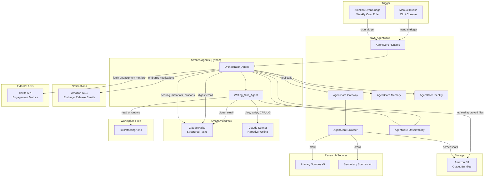
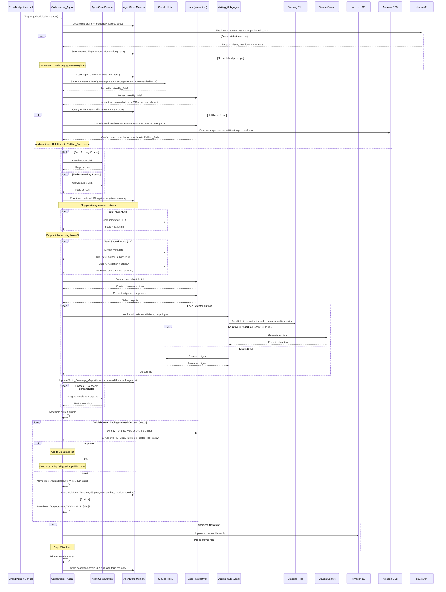

# Design Document — Magic Content Engine

## Overview

The Magic Content Engine is a scheduled, AWS-hosted agent application that automates weekly content research and generation for an AI Engineering niche focused on Kiro IDE, AgentCore, and Strands from the Oceania community perspective. The system is built with the Strands Agents SDK (Python), deployed on AgentCore Runtime, and orchestrated through two cooperating agents: an Orchestrator_Agent that manages the end-to-end workflow, and a Writing_Sub_Agent that produces formatted content outputs.

The engine runs on a weekly EventBridge schedule (with manual invoke support), crawls 9 research sources, scores articles by relevance using Claude Haiku, builds APA 7th edition citations, captures screenshots via AgentCore Browser, and generates a selectable set of content outputs (blog post, YouTube script, CFP proposal, user group session outline, weekly digest email). A cost-optimised model routing strategy sends structured tasks to Claude Haiku and narrative writing to Claude Sonnet. All outputs are assembled into a structured bundle and uploaded to S3.

Voice rules and output templates are loaded at runtime from `.kiro/steering/` files, not baked into agent prompts, so they can be updated without redeployment.

## Architecture



### Workflow Sequence



## Components and Interfaces

### 1. Orchestrator_Agent

The primary Strands agent deployed on AgentCore Runtime. It coordinates the full workflow.

**Responsibilities:**
- Accept EventBridge or manual triggers
- Crawl all research sources via AgentCore Browser
- Deduplicate articles against AgentCore Memory (long-term)
- Route articles to Claude Haiku for relevance scoring
- Route scored articles to Claude Haiku for metadata extraction and APA citation building
- Present scored articles and output choice prompt to the user
- Invoke the Writing_Sub_Agent for each selected content output
- Capture screenshots via AgentCore Browser
- Assemble the output bundle directory
- Upload the bundle to S3
- Track token usage and generate cost estimates
- Emit trace spans to AgentCore Observability
- Print terminal summary

**Interface (inbound):**
```python
# Trigger payload from EventBridge or manual invoke
{
    "source": "scheduled" | "manual",
    "run_date": "YYYY-MM-DD",
    "override_outputs": [int] | null  # optional, for unattended runs
}
```

**Interface (to Writing_Sub_Agent):**
```python
{
    "articles": [ArticleWithCitation],   # confirmed articles with APA citations
    "output_type": "blog" | "youtube" | "cfp" | "usergroup" | "digest",
    "steering_base_path": ".kiro/steering/",
    "screenshots_path": "screenshots/",
    "run_date": "YYYY-MM-DD",
    "slug": str
}
```

### 2. Writing_Sub_Agent

A secondary Strands agent invoked by the Orchestrator_Agent for each content output type.

**Responsibilities:**
- Read steering files from disk at runtime (REQ-029)
- Load `01-niche-and-voice.md` for every invocation
- Load the output-specific steering file (03, 04, or 05) based on output type
- Generate formatted content using the appropriate model (Sonnet for narrative, Haiku for digest)
- Apply voice rules: no banned phrases, no em-dashes, no opening with "I", short sentences
- Insert placeholder blocks for the content owner
- Return the generated file content to the Orchestrator_Agent

**Steering file mapping:**
| Output Type | Steering File |
|---|---|
| Blog post | `03-output-blog-post.md` |
| YouTube script | `04-output-youtube.md` |
| CFP proposal | `05-output-talks.md` |
| User group session | `05-output-talks.md` |
| Weekly digest email | `01-niche-and-voice.md` only |

**Runtime steering file loading (REQ-029):**
```python
import pathlib

def load_steering(base_path: str, output_type: str) -> dict[str, str]:
    """Read steering files from disk at runtime. Never cached in agent definition."""
    base = pathlib.Path(base_path)
    files = {"voice": base / "01-niche-and-voice.md"}
    
    mapping = {
        "blog": "03-output-blog-post.md",
        "youtube": "04-output-youtube.md",
        "cfp": "05-output-talks.md",
        "usergroup": "05-output-talks.md",
    }
    if output_type in mapping:
        files["template"] = base / mapping[output_type]
    
    result = {}
    for key, path in files.items():
        if not path.exists():
            raise FileNotFoundError(f"Steering file missing: {path}")
        result[key] = path.read_text(encoding="utf-8")
    return result
```

### 3. AgentCore Service Integration

| Service | Usage |
|---|---|
| **Runtime** | Hosts both Orchestrator_Agent and Writing_Sub_Agent as managed Strands agents |
| **Browser** | Crawls research source URLs, captures screenshots at 1440x900 viewport |
| **Memory (short-term)** | Session state during a run: current article list, scoring progress, selected outputs |
| **Memory (long-term)** | Persists across runs: previously covered article URLs, run dates, voice profile, content preferences |
| **Gateway** | Exposes externally accessible MCP tools (e.g. `invoke_content_run`) to other agents and callers. Internal Strands tool calls use the SDK directly. |
| **Identity** | Manages credentials for GitHub API. No secrets in source code. |
| **Observability** | Trace spans per workflow step, error-level events, per-step latency recording |

**Additional AWS services (not AgentCore):**

| Service | Usage |
|---|---|
| **Amazon SES** | Sends embargo release notifications to the configured recipient email address (REQ-032) |

**External APIs:**

| Service | Usage |
|---|---|
| **dev.to API** | Retrieves engagement metrics (views, reactions, comments, reading time) for published posts. Credential managed by AgentCore Identity in production, `.env` file in local development. Gracefully skipped if unreachable or no posts exist yet. |

### 4. Model Router

A configuration-driven component that selects the Bedrock model for each task type.

```python
from enum import Enum

class TaskType(Enum):
    RELEVANCE_SCORING = "relevance_scoring"
    METADATA_EXTRACTION = "metadata_extraction"
    APA_CITATION = "apa_citation"
    DIGEST_EMAIL = "digest_email"
    WEEKLY_BRIEF = "weekly_brief"
    BLOG_POST = "blog_post"
    YOUTUBE_SCRIPT = "youtube_script"
    CFP_ABSTRACT = "cfp_abstract"
    USERGROUP_OUTLINE = "usergroup_outline"

MODEL_ROUTING: dict[TaskType, str] = {
    TaskType.RELEVANCE_SCORING: "claude-haiku",
    TaskType.METADATA_EXTRACTION: "claude-haiku",
    TaskType.APA_CITATION: "claude-haiku",
    TaskType.DIGEST_EMAIL: "claude-haiku",
    TaskType.WEEKLY_BRIEF: "claude-haiku",
    TaskType.BLOG_POST: "claude-sonnet",
    TaskType.YOUTUBE_SCRIPT: "claude-sonnet",
    TaskType.CFP_ABSTRACT: "claude-sonnet",
    TaskType.USERGROUP_OUTLINE: "claude-sonnet",
}

def get_model(task: TaskType) -> str:
    return MODEL_ROUTING[task]
```

### 5. Weekly Brief Generator

Generates a personalised run summary using Claude Haiku before the research crawl begins.

**Inputs:**
- Topic_Coverage_Map from AgentCore Memory (long-term)
- Engagement_Metrics from AgentCore Memory (long-term) (may be empty for new accounts)
- Current run date

**Output — Weekly_Brief terminal display:**

```
Weekly brief — YYYY-MM-DD

Top performing content (past 7 days):
  [title] — [views] views, [reactions] reactions
  [omitted if no published content yet]

Topic coverage map:
  Covered: [topic list with most recent run date]
  Not yet covered: [gap list]

Recommended focus this week: [topic]

Press Enter to accept, or type a different topic:
```

- Top performing content: highest-engagement post from past 7 days (title, views, reactions). Omitted if no published content yet, with clean state message: "No published content yet — engagement tracking will begin after your first post."
- Topic coverage map: covered topics with most recent run date, uncovered topics listed as gaps
- Recommended focus: one topic derived from gap analysis weighted by engagement signals and available high-scoring articles

**Clean state behaviour (REQ-034 criteria 8-10):**
When no posts have been published yet, the Weekly_Brief omits the top performing content section and displays the clean state message. Engagement weighting is disabled until at least one post has accumulated metrics. Scoring relies solely on relevance criteria and topic gap analysis until then.

**User interaction:**
The user can accept the recommended focus (press Enter) or override it by entering a different topic. The override is stored in the WeeklyBrief dataclass and used to weight scoring during the research phase.

### 6. APA Citation Builder

A pipeline that extracts metadata from article pages and produces APA 7th edition citations.

**Pipeline stages:**
1. **Metadata extraction** (Claude Haiku): Extract title, date, author, publisher, URL from page HTML/meta tags
2. **Fallback application**: Use "Amazon Web Services" when author or publisher is missing
3. **APA formatting** (Claude Haiku): Format as `Author, A. A. (Year, Month Day). *Title*. Site Name. URL`
4. **In-text citation**: Format as `(Surname, Year)` or `(Amazon Web Services, Year)`
5. **BibTeX generation**: Convert each citation to a `@online{}` BibTeX entry
6. **Aggregation**: Collect all BibTeX entries into `references.bib`, sorted alphabetically

### 7. Screenshot Capture Service

Uses AgentCore Browser to capture PNG screenshots.

**Configuration:**
- Viewport: 1440 x 900 pixels
- Wait strategy: minimum 3 seconds after navigation (for React page rendering)
- File naming: kebab-case, matching the section they illustrate

**Capture targets:**
| Filename | Target |
|---|---|
| `console-runtime.png` | AgentCore Runtime dashboard |
| `console-gateway.png` | AgentCore Gateway tool list |
| `console-memory.png` | AgentCore Memory records |
| `console-observability.png` | AgentCore Observability trace |
| `sample-output.png` | Generated digest rendered as HTML |
| `research/YYYY-MM-DD-[source].png` | Each confirmed article's source landing page |

### 8. Output Bundle Assembler

Assembles the final directory structure and uploads to S3.

**Directory structure:**
```
output/YYYY-MM-DD-[slug]/
  post.md                  # if blog selected
  script.md                # if YouTube selected
  description.txt          # if YouTube selected
  cfp-proposal.md          # if CFP selected
  usergroup-session.md     # if user group selected
  digest-email.txt         # if digest selected
  references.bib           # always
  cost-estimate.txt        # always
  screenshots/
    research/              # confirmed article landing pages
    console-runtime.png
    console-gateway.png
    console-memory.png
    console-observability.png
    sample-output.png
  agent-log.json           # always

output/held/YYYY-MM-DD-[slug]/
  [content files held for embargo release]

output/review/YYYY-MM-DD-[slug]/
  [content files held for manual review]
```

**Slug generation (REQ-028):**
- Derived from the primary topic of the confirmed article list
- Kebab-case: lowercase alphanumeric characters and hyphens only
- Combined with run date: `YYYY-MM-DD-[slug]`

## Data Models

### Article

```python
from dataclasses import dataclass, field
from datetime import date
from typing import Optional

@dataclass
class Article:
    url: str
    title: str
    source: str                          # e.g. "kiro.dev/changelog/ide/"
    source_type: str                     # "primary" | "secondary"
    discovered_date: date
    relevance_score: Optional[int] = None  # 1-5, assigned by Haiku
    scoring_rationale: Optional[str] = None
    status: str = "discovered"           # discovered | scored | excluded | confirmed | previously_covered
```

### ArticleMetadata

```python
@dataclass
class ArticleMetadata:
    article_url: str
    title: str                           # from og:title or HTML title
    publication_date: Optional[str] = None  # from og:published_time
    author: str = "Amazon Web Services"  # fallback default
    publisher: str = "Amazon Web Services"  # fallback default
    canonical_url: Optional[str] = None
```

### APACitation

```python
@dataclass
class APACitation:
    metadata: ArticleMetadata
    reference_entry: str                 # Full APA 7th reference string
    in_text_citation: str                # (Surname, Year) format
    bibtex_entry: str                    # @online{} BibTeX block
```

### OutputBundle

```python
@dataclass
class OutputBundle:
    run_date: date
    slug: str
    selected_outputs: list[str]          # ["blog", "youtube", "cfp", ...]
    generated_files: list[str]           # relative paths of files created
    references_bib: str                  # aggregated BibTeX content
    cost_estimate: CostEstimate
    agent_log: AgentLog
    s3_key_prefix: str                   # "output/YYYY-MM-DD-[slug]/"
```

### CostEstimate

```python
@dataclass
class ModelInvocation:
    task_type: str
    model: str                           # "claude-haiku" | "claude-sonnet"
    input_tokens: int
    output_tokens: int
    estimated_cost_usd: float

@dataclass
class CostEstimate:
    invocations: list[ModelInvocation]
    total_llm_cost_usd: float
    total_agentcore_cost_usd: float
    total_cost_usd: float
```

### AgentLog

```python
@dataclass
class AgentLog:
    run_date: str
    invocation_source: str               # "scheduled" | "manual"
    articles_found: int
    articles_kept: int
    articles: list[dict]                 # per-article: url, score, status
    model_usage: list[dict]              # per-task: task, model, tokens
    screenshot_results: list[dict]       # per-screenshot: filename, success, error
    errors: list[dict]                   # step, message, context
    selected_outputs: list[str]
    run_metadata: dict                   # timing, versions, etc.
```

### ScreenshotCapture

```python
@dataclass
class ScreenshotCapture:
    target_url: str
    filename: str                        # e.g. "console-runtime.png"
    viewport_width: int = 1440
    viewport_height: int = 900
    wait_seconds: int = 3
    success: bool = False
    error: Optional[str] = None
```

### HeldItem

```python
@dataclass
class HeldItem:
    filename: str                        # e.g. "post.md"
    s3_destination_path: str             # e.g. "output/2025-07-14-agentcore-browser-launch/post.md"
    release_date: date                   # embargo release date (YYYY-MM-DD)
    article_titles: list[str]            # titles of articles covered in this output
    run_date: date                       # date of the run that generated this output
    local_file_path: str                 # e.g. "./output/held/2025-07-14-agentcore-browser-launch/post.md"
```

### ReviewItem

```python
@dataclass
class ReviewItem:
    filename: str                        # e.g. "cfp-proposal.md"
    run_date: date                       # date of the run that generated this output
    local_file_path: str                 # e.g. "./output/review/2025-07-14-agentcore-browser-launch/cfp-proposal.md"
    reason: str                          # e.g. "held for manual review"
```

### TopicCoverageEntry

```python
@dataclass
class TopicCoverageEntry:
    topic: str                           # e.g. "AgentCore Runtime"
    covered: bool
    article_titles: list[str]            # titles of articles that covered this topic
    last_covered_date: Optional[date] = None
    adjacent_topics: list[str] = field(default_factory=list)  # natural next topics
```

### TopicCoverageMap

```python
@dataclass
class TopicCoverageMap:
    entries: list[TopicCoverageEntry]
    last_updated: date
    recommended_focus: Optional[str] = None  # set at start of each run
```

### PostEngagement

```python
@dataclass
class PostEngagement:
    post_title: str
    publication_date: date
    url: str
    views: int = 0
    reactions: int = 0
    comments: int = 0
    reading_time_minutes: int = 0
    last_fetched: Optional[date] = None
```

### WeeklyBrief

```python
@dataclass
class WeeklyBrief:
    run_date: date
    top_post: Optional[PostEngagement]   # None if no published content yet
    coverage_map: TopicCoverageMap
    recommended_focus: str
    user_override: Optional[str] = None  # set if user overrides recommendation
    clean_state: bool = False            # True if no published content yet
```

### S3 Storage Structure

```
s3://[configured-bucket]/
  output/
    2025-07-14-agentcore-browser-launch/
      post.md
      script.md
      description.txt
      references.bib
      cost-estimate.txt
      screenshots/
        research/
          2025-07-14-kiro-changelog.png
          2025-07-14-aws-new.png
        console-runtime.png
        console-gateway.png
        console-memory.png
        console-observability.png
        sample-output.png
      agent-log.json
    2025-07-07-strands-sdk-update/
      ...
```

Key prefix format: `output/YYYY-MM-DD-[slug]/`

### EventBridge Configuration

```json
{
  "ScheduleExpression": "cron(0 9 ? * MON *)",
  "Description": "Weekly Magic Content Engine trigger - Mondays 9am UTC",
  "Target": {
    "Arn": "arn:aws:agentcore:[region]:[account]:agent/orchestrator-agent",
    "Input": "{\"source\": \"scheduled\", \"run_date\": \"{{date}}\"}"
  }
}
```

The cron expression is configurable via environment variable. Default: Monday 9am UTC.

### Environment Variables and Configuration

| Variable | Description | Default | Local | Production |
|---|---|---|---|---|
| `S3_BUCKET` | Output bundle bucket name | — | `magic-content-dev` | `magic-content-prod` |
| `S3_KEY_PREFIX` | Key prefix for bundles | `output/` | `output/` | `output/` |
| `EVENTBRIDGE_CRON` | Weekly schedule expression | `cron(0 9 ? * MON *)` | N/A | `cron(0 9 ? * MON *)` |
| `STEERING_BASE_PATH` | Path to steering files | `.kiro/steering/` | `.kiro/steering/` | `.kiro/steering/` |
| `HAIKU_MODEL_ID` | Bedrock model ID for Haiku | `anthropic.claude-3-5-haiku-20241022-v1:0` | same | same |
| `SONNET_MODEL_ID` | Bedrock model ID for Sonnet | `anthropic.claude-sonnet-4-20250514-v1:0` | same | same |
| `RELEVANCE_THRESHOLD` | Minimum score to keep articles | `3` | `3` | `3` |
| `SCREENSHOT_VIEWPORT_W` | Browser viewport width | `1440` | `1440` | `1440` |
| `SCREENSHOT_VIEWPORT_H` | Browser viewport height | `900` | `900` | `900` |
| `SCREENSHOT_WAIT_S` | Seconds to wait after navigation | `3` | `3` | `3` |
| `MAX_RETRY_ATTEMPTS` | Retry count for source crawls and S3 | `3` | `3` | `3` |
| `LOG_LEVEL` | Logging verbosity | `INFO` | `DEBUG` | `INFO` |
| `GITHUB_TOKEN` | GitHub API token | — | `.env` file | AgentCore Identity |
| `SES_SENDER_EMAIL` | Verified SES sender address | — | `.env` file | configured in deployment |
| `SES_RECIPIENT_EMAIL` | Notification recipient address | — | `.env` file | configured in deployment |
| `HELD_OUTPUT_PATH` | Local path for held content | `./output/held/` | `./output/held/` | `./output/held/` |
| `REVIEW_OUTPUT_PATH` | Local path for review content | `./output/review/` | `./output/review/` | `./output/review/` |
| `DEVTO_API_KEY` | dev.to API key for engagement metric retrieval | — | `.env` file | AgentCore Identity |
| `DEVTO_USERNAME` | dev.to username for post lookup | — | `.env` file | environment variable |

**Local development:**
- Create a `.env` file (excluded via `.gitignore`) with `GITHUB_TOKEN`, `DEVTO_API_KEY`, and `DEVTO_USERNAME`
- Run the orchestrator directly: `python -m magic_content_engine.orchestrator --source manual`
- AgentCore services are accessed via local SDK configuration pointing to your AWS account
- Set `LOG_LEVEL=DEBUG` for verbose output

**Production:**
- Credentials managed by AgentCore Identity (no `.env` file, no secrets in code)
- EventBridge triggers the agent on the configured cron schedule
- S3 bucket configured with appropriate IAM policies

## Correctness Properties

*A property is a characteristic or behavior that should hold true across all valid executions of a system — essentially, a formal statement about what the system should do. Properties serve as the bridge between human-readable specifications and machine-verifiable correctness guarantees.*

### Property 1: Manual and scheduled invocations produce equivalent workflows

*For any* trigger payload, whether the invocation source is "scheduled" or "manual", the Orchestrator_Agent should execute the same sequence of workflow steps (crawl, score, extract, cite, prompt, generate, capture, assemble) and produce structurally equivalent output bundles given the same input state.

**Validates: Requirements 1.2**

### Property 2: Article deduplication round-trip

*For any* article URL that has been confirmed in a previous run and stored in AgentCore Memory (long-term), when that URL is discovered in a subsequent run, the deduplication check should return a match and the article should be excluded from scoring with status "previously_covered". Conversely, for any article URL not in long-term memory, the deduplication check should return no match.

**Validates: Requirements 4.1, 4.2, 4.3**

### Property 3: AWS news keyword filter correctness

*For any* article discovered from aws.amazon.com/new/, the article should only pass the filter if its content contains at least one of the keywords: "bedrock", "agentcore", "kiro", or "lambda" (case-insensitive).

**Validates: Requirements 2.2**

### Property 4: Relevance score range invariant

*For any* article submitted for relevance scoring, the returned Relevance_Score should be an integer in the range [1, 5] inclusive.

**Validates: Requirements 5.1**

### Property 5: Score threshold filter

*For any* set of scored articles, the articles passed to subsequent processing (metadata extraction, citation building, user presentation) should include only those with a Relevance_Score of 3 or above. No article with a score below 3 should appear in the output.

**Validates: Requirements 5.3, 8.1**

### Property 6: Metadata completeness with fallbacks

*For any* article that passes relevance scoring, the extracted metadata should contain non-empty values for: title, author, publisher, and canonical URL. When the source page lacks an author, the author field should equal "Amazon Web Services". When the source page lacks a publisher, the publisher field should equal "Amazon Web Services".

**Validates: Requirements 6.1, 6.2, 6.3**

### Property 7: APA citation round-trip

*For any* valid ArticleMetadata, formatting it as an APA 7th edition reference string and then parsing that string back should produce metadata equivalent to the original (author, year, title, site name, URL all preserved).

**Validates: Requirements 7.5**

### Property 8: Citation contains all required components

*For any* valid ArticleMetadata, the generated APA reference entry should contain the author name, publication year, article title, site name, and URL. The in-text citation should match the pattern `(Surname, Year)` or `(Amazon Web Services, Year)`. The BibTeX entry should be a valid `@online{}` block containing all metadata fields.

**Validates: Requirements 7.1, 7.2, 7.3**

### Property 9: BibTeX aggregation completeness

*For any* set of N confirmed articles with APA citations, the generated `references.bib` file should contain exactly N BibTeX entries, and every citation's BibTeX key should appear in the file.

**Validates: Requirements 7.4**

### Property 10: User removal exclusion

*For any* article that the user removes from the confirmed list, that article should not appear in the input to any Writing_Sub_Agent invocation, and the removal should be recorded in the Agent_Log.

**Validates: Requirements 8.3**

### Property 11: Output selection conditional inclusion

*For any* user selection of content output types, the assembled Output_Bundle should contain exactly the files corresponding to the selected types, plus the always-included files (references.bib, cost-estimate.txt, screenshots/, agent-log.json). No unselected content output file should be present.

**Validates: Requirements 9.2, 17.2**

### Property 12: Model routing correctness

*For any* task type, the model router should return "claude-haiku" for relevance scoring, metadata extraction, APA citation formatting, and digest email generation, and "claude-sonnet" for blog post writing, YouTube script writing, CFP abstract writing, and user group session outline writing.

**Validates: Requirements 10.1, 10.2**

### Property 13: Content output structure completeness

*For any* selected content output type and any set of confirmed articles with citations, the generated content file should contain all sections required by the corresponding steering file template. Specifically:
- Blog post: hook placeholder, architecture section with screenshot ref, build walkthrough with inline citations, cost breakdown table, sample output section, Oceania placeholder, closing placeholder, references section.
- YouTube script: thumbnail concept, YouTube description with hashtags, cold open placeholder, four scripted sections (problem, architecture, build, results+cost), outro placeholder.
- CFP proposal: 3 title options, abstract ≤250 words, 3 takeaways, target audience, 25-min outline, 45-min outline, speaker bio, personal note placeholder, events list.
- User group session: recommended format with rationale, session outline, live demo steps, slide outline (≤12 slides for 30 min), opening story placeholder.
- Digest email: personal note placeholder, 3-4 sentences per article, grouped by theme when ≥5 articles.

**Validates: Requirements 11.1-11.10, 12.1-12.7, 13.1-13.11, 14.1-14.7, 15.1-15.5**

### Property 14: Voice rules compliance

*For any* generated text content across all output types, the text should not contain any of the banned phrases ("leverage", "empower", "unlock", "dive into", "game-changer"), should not contain em-dash characters (— or &#8212;), should not have any paragraph or section opening with the word "I", and all placeholder blocks should match the pattern `<!-- MIKE: ... -->` with no generated content inside them.

**Validates: Requirements 18.3, 18.4, 18.5, 18.8**

### Property 15: Slug format invariant

*For any* generated slug, the slug should match the regex `^[a-z0-9]+(-[a-z0-9]+)*$` (lowercase alphanumeric characters and hyphens only, no leading/trailing/consecutive hyphens), and the output directory name should match `YYYY-MM-DD-[slug]` where the date is the run date.

**Validates: Requirements 28.1, 28.2, 28.3**

### Property 16: Screenshot viewport configuration

*For any* screenshot capture operation, the browser viewport should be configured to exactly 1440 pixels wide by 900 pixels tall before the capture is taken.

**Validates: Requirements 16.1**

### Property 17: Research screenshot completeness

*For any* article that is confirmed by the user, a screenshot should be captured of the article's source landing page and saved with the filename pattern `screenshots/research/YYYY-MM-DD-[source].png`.

**Validates: Requirements 16.4**

### Property 18: Observability trace completeness

*For any* workflow step (crawling, scoring, metadata extraction, citation building, user interaction, content generation, screenshot capture, bundle assembly), a trace span should be emitted to AgentCore Observability, and each span should include a recorded latency duration.

**Validates: Requirements 23.1, 23.3**

### Property 19: Agent log completeness

*For any* completed run, the agent-log.json should contain: the invocation source ("scheduled" or "manual"), the count and details of articles found, the Relevance_Score and scoring rationale for each scored article, the model used for each task invocation, screenshot capture results (success/failure per target), all errors encountered, and the list of selected outputs.

**Validates: Requirements 1.3, 5.4, 10.3, 17.4**

### Property 20: Cost estimation correctness

*For any* set of model invocations during a run, the cost estimate should track input and output token counts per invocation, calculate cost using the correct Bedrock pricing for the model used, and the total cost should equal the sum of all individual invocation costs plus AgentCore service costs. The cost-estimate.txt file should contain a breakdown by task type, model, token count, and estimated cost.

**Validates: Requirements 26.1, 26.2, 26.3**

### Property 21: Terminal summary completeness

*For any* completed run, the terminal summary should contain: total articles found, articles kept after scoring, list of content outputs generated, estimated run cost, and any screenshot capture failures.

**Validates: Requirements 25.1**

### Property 22: Steering file loading correctness

*For any* content generation invocation, the Writing_Sub_Agent should load `01-niche-and-voice.md` from the filesystem. Additionally, for blog output it should load `03-output-blog-post.md`, for YouTube output `04-output-youtube.md`, and for CFP or user group output `05-output-talks.md`. The steering file contents should be read from disk at invocation time, not from a cached or hardcoded source.

**Validates: Requirements 29.2, 29.3**

### Property 23: Publish Gate completeness

*For any* completed run, no Content_Output file should be present in the S3 upload unless it received an explicit [1] Approve selection at the Publish_Gate. Files assigned Hold, Skip, or Review status should not appear in S3.

**Validates: Requirements 30.7**

### Property 24: Held item storage correctness

*For any* Content_Output assigned Hold status at the Publish_Gate, a HeldItem record should be stored in AgentCore Memory (long-term) containing the correct filename, release date, and S3 destination path. The file should be present at `./output/held/YYYY-MM-DD-[slug]/` and absent from the S3 upload.

**Validates: Requirements 30.5, 31.5**

### Property 25: Auto-publish prohibition

*For any* run where a HeldItem's release date has passed, the system should send an SES notification and present the item for manual Publish_Gate review, but should not upload the file to S3 without explicit user approval.

**Validates: Requirements 32.3, 32.5**

### Property 26: Topic coverage map updated after each run

*For any* run where at least one Article is confirmed and content is generated, the Topic_Coverage_Map in AgentCore Memory (long-term) should be updated to include the topics covered in that run, with the correct run date and article titles recorded. Topics covered in previous runs should remain in the map and not be overwritten.

**Validates: Requirements 33.1, 33.2, 33.6**

### Property 27: Engagement weighting disabled until first post

*For any* run where no Engagement_Metrics exist in AgentCore Memory (long-term), relevance scoring should not apply engagement weighting. The scored article set should be identical to what would be produced using only the relevance scoring criteria (REQ-005) and topic gap analysis (REQ-033). The Weekly_Brief should omit the top performing content section and display the clean state message.

**Validates: Requirements 34.9, 34.10, 35.2**

### Property 28: Weekly Brief recommended focus derivation

*For any* run, the recommended focus topic in the Weekly_Brief should be derivable from the Topic_Coverage_Map gap analysis. Specifically: if topic A has been covered and topic B is listed as an adjacent topic to A and has not been covered, and a high-scoring article about topic B exists in the current crawl, then topic B should appear as the recommended focus or in the uncovered topics list.

**Validates: Requirements 33.4, 35.2**

## Error Handling

### Per-Step Error Isolation

The engine follows a "log and continue" strategy. A failure in one step should not abort the entire run. Each workflow step is wrapped in error handling that catches exceptions, logs them to the Agent_Log and AgentCore Observability, and proceeds to the next item or step.

| Step | Failure Behaviour | Retry | Logged To |
|---|---|---|---|
| Source crawl (primary or secondary) | Skip source, continue remaining | 3 attempts | Agent_Log + Observability |
| Metadata extraction (single article) | Skip article, continue remaining | No retry (LLM call) | Agent_Log + Observability |
| Relevance scoring (single article) | Skip article, continue remaining | No retry (LLM call) | Agent_Log + Observability |
| APA citation building | Skip article, continue remaining | No retry (LLM call) | Agent_Log + Observability |
| Content output generation | Skip output, continue remaining | No retry (LLM call) | Agent_Log + Observability |
| Screenshot capture | Log failure, continue remaining | No retry | Agent_Log + Observability |
| S3 upload | Retry with exponential backoff | 3 attempts (1s, 2s, 4s) | Agent_Log + Observability |
| Steering file read | Abort that content output only | No retry | Agent_Log + Observability |
| SES notification delivery | Log failure, continue run | No retry | Agent_Log + Observability |

### Retry Strategy

- **Source crawls**: 3 attempts with 2-second fixed delay between attempts.
- **S3 upload**: 3 attempts with exponential backoff (1s, 2s, 4s base delays).
- **LLM calls**: No automatic retry. LLM failures are logged and the item is skipped.
- **Screenshot captures**: No retry. Failures are logged and included in the terminal summary.

### Error Propagation

```python
@dataclass
class StepError:
    step: str           # e.g. "crawl", "score", "extract", "generate", "screenshot", "upload"
    target: str         # e.g. source URL, article URL, output type, screenshot filename
    error_message: str
    context: dict       # additional context (retry count, model used, etc.)
```

All StepErrors are collected during the run and included in:
1. `agent-log.json` (errors array)
2. AgentCore Observability (error-level trace events)
3. Terminal summary (failed screenshots, failed sources)

## Testing Strategy

### Dual Testing Approach

The Magic Content Engine uses both unit tests and property-based tests for comprehensive coverage.

- **Unit tests** verify specific examples, edge cases, integration points, and error conditions.
- **Property-based tests** verify universal properties across randomly generated inputs.

Together they provide complementary coverage: unit tests catch concrete bugs at known boundaries, property tests verify general correctness across the input space.

### Property-Based Testing Configuration

- **Library**: [Hypothesis](https://hypothesis.readthedocs.io/) (Python)
- **Minimum iterations**: 100 per property test (configured via `@settings(max_examples=100)`)
- **Each property test references its design document property** using the tag format:
  `Feature: magic-content-engine, Property {number}: {property_text}`

Each correctness property from the design document is implemented by a single Hypothesis property-based test.

### Property Test Plan

| Property | Test Description | Key Generators |
|---|---|---|
| 1: Manual/scheduled equivalence | Generate random trigger payloads with both sources, verify same workflow steps execute | `st.sampled_from(["scheduled", "manual"])`, random article sets |
| 2: Dedup round-trip | Store random URLs in memory, rediscover them, verify exclusion | `st.text()` for URLs, `st.dates()` for run dates |
| 3: Keyword filter | Generate random article text with/without keywords, verify filter correctness | `st.text()`, `st.sampled_from(["bedrock", "agentcore", "kiro", "lambda"])` |
| 4: Score range invariant | Generate random articles, score them, verify scores in [1,5] | Random `Article` instances |
| 5: Score threshold filter | Generate random scored article sets, verify only score ≥3 pass through | `st.integers(min_value=1, max_value=5)` for scores |
| 6: Metadata completeness + fallbacks | Generate metadata with missing fields, verify fallbacks applied | `st.none()` | `st.text()` for optional fields |
| 7: APA citation round-trip | Generate random metadata, format as APA, parse back, verify equivalence | Random `ArticleMetadata` instances |
| 8: Citation components | Generate random metadata, verify APA ref, in-text, and BibTeX contain all fields | Random `ArticleMetadata` instances |
| 9: BibTeX aggregation | Generate N random citations, verify references.bib has exactly N entries | `st.lists(st.from_type(APACitation))` |
| 10: User removal exclusion | Generate article lists with random removals, verify excluded from generation input | Random article lists + removal indices |
| 11: Output selection inclusion | Generate random output selections, verify bundle contains exactly those files + always-included | `st.sets(st.sampled_from(["blog","youtube","cfp","usergroup","digest"]))` |
| 12: Model routing | For all task types, verify correct model returned | `st.sampled_from(TaskType)` |
| 13: Content structure completeness | Generate random articles, produce each output type, verify required sections present | Random article sets per output type |
| 14: Voice rules compliance | Generate content, scan for banned phrases, em-dashes, "I" openings, placeholder format | All generated text outputs |
| 15: Slug format | Generate random topic strings, verify slug matches `^[a-z0-9]+(-[a-z0-9]+)*$` | `st.text(alphabet=st.characters())` |
| 16: Viewport config | For all screenshot captures, verify viewport is 1440x900 | Random `ScreenshotCapture` instances |
| 17: Research screenshot completeness | Generate random confirmed article lists, verify each has a screenshot | Random confirmed article lists |
| 18: Observability traces | Execute random workflow steps, verify trace spans emitted with latency | `st.sampled_from(workflow_steps)` |
| 19: Agent log completeness | Generate random run results, verify log contains all required fields | Random run result data |
| 20: Cost estimation | Generate random token counts and model IDs, verify cost calculation | `st.integers()` for tokens, model IDs |
| 21: Terminal summary | Generate random run results, verify summary contains all required fields | Random run result data |
| 22: Steering file loading | For all output types, verify correct steering files are loaded | `st.sampled_from(output_types)` |
| 23: Publish Gate completeness | Generate random output sets with random Publish_Gate decisions (approve/skip/hold/review), verify only approved files appear in S3 upload list | `st.sampled_from(["approve","skip","hold","review"])`, random output file sets |
| 24: Held item storage | Generate random outputs assigned Hold status with random release dates, verify HeldItem stored in memory with correct fields and file present in held path | Random `HeldItem` instances, `st.dates()` for release dates |
| 25: Auto-publish prohibition | Generate random HeldItems with release dates in the past, simulate a run, verify SES notification sent and no S3 upload without explicit approval | Random `HeldItem` lists, `st.dates()`, `st.booleans()` for user approval |
| 26: Topic coverage map updated | Generate random confirmed article sets with topic tags, run the coverage map update, verify new topics added and existing topics preserved | Random article lists with topic metadata, `st.dates()` for run dates |
| 27: Engagement weighting disabled | Generate runs with empty Engagement_Metrics in memory, verify scoring output identical to relevance-only scoring, verify Weekly_Brief clean state message present | Empty vs populated engagement metric stores, random article sets |
| 28: Weekly Brief focus derivation | Generate coverage maps with known gaps and adjacent topic chains, verify recommended focus matches expected next topic | Random `TopicCoverageMap` instances with controlled gap patterns |

### Unit Test Plan

Unit tests focus on specific examples, edge cases, and error conditions:

- **Edge cases** (from prework analysis):
  - Source crawl failure after 3 retries (REQ 2.3, 3.2)
  - Screenshot capture failure logging (REQ 16.5)
  - S3 upload retry with exponential backoff (REQ 24.2)
  - Missing steering file aborts content generation (REQ 29.5)
  - Error trace events emitted on failures (REQ 23.2)
  - Graceful continuation after crawl/extraction/generation/screenshot failures (REQ 27.1-27.5)

- **Specific examples**:
  - All 5 primary sources are crawled (REQ 2.1)
  - All 4 secondary sources are crawled (REQ 3.1)
  - Output choice prompt presents options 1-6 (REQ 9.1)
  - Unattended mode defaults to blog + YouTube (REQ 9.3)
  - Console screenshots list matches expected filenames (REQ 16.3)
  - Clean run status indicated when no errors (REQ 25.2)
  - Steering file loading reads from disk for each output type (REQ 29.1)
  - S3 upload to correct key prefix (REQ 17.5)
  - dev.to API returns no posts — clean state logged, engagement weighting skipped, no error raised (REQ 34.8)
  - dev.to API unreachable — failure logged, run continues with standard scoring (REQ 34.6)
  - User accepts recommended focus — override is None in WeeklyBrief (REQ 35.4)
  - User overrides recommended focus — override stored and used in scoring weight (REQ 35.5)
  - Topic Coverage Map empty on first run — Weekly Brief shows all topics as uncovered (REQ 33.1)

### Test Tagging Convention

Every property-based test includes a docstring tag:

```python
from hypothesis import given, settings
import hypothesis.strategies as st

@given(metadata=article_metadata_strategy())
@settings(max_examples=100)
def test_apa_citation_round_trip(metadata):
    """Feature: magic-content-engine, Property 7: APA citation round-trip"""
    formatted = format_apa_reference(metadata)
    parsed = parse_apa_reference(formatted)
    assert parsed.author == metadata.author
    assert parsed.title == metadata.title
    assert parsed.url == metadata.canonical_url
```
