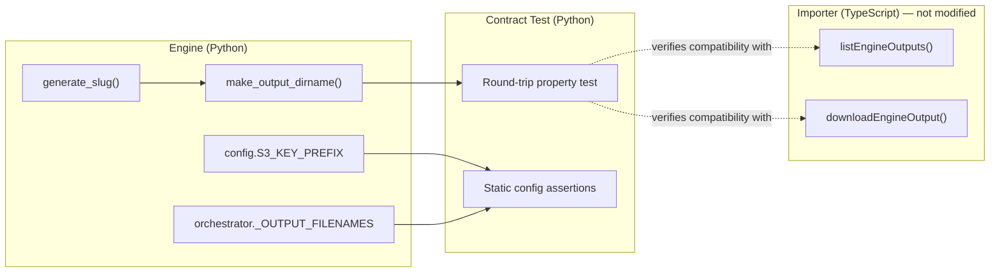

# Design Document: S3 Key Alignment

## Overview

This design formalises the implicit S3 key format contract between the magic-content-engine (Engine) and the mikefromnz admin importer (Importer). Both systems already implement the contract correctly. The work here is purely about documentation and automated verification — no runtime code changes are needed.

Three deliverables:

1. A contract test file (`test_s3_key_contract.py`) that uses Hypothesis to verify the round-trip property between Engine key production and Importer key parsing.
2. A new "S3 Key Format" section in the Engine's `README.md`.
3. A compatibility annotation on `S3_KEY_PREFIX` in `.env.example`.

### The Contract

The S3 key format is:

```
output/{YYYY-MM-DD}-{slug}/post.md
```

Where:
- `output/` is the `S3_KEY_PREFIX` (configurable, default `output/`)
- `{YYYY-MM-DD}` is the ISO 8601 run date (always exactly 10 characters)
- `-` is a single hyphen separator at position 10 of the dir-name segment
- `{slug}` matches `^[a-z0-9]+(-[a-z0-9]+)*$`
- `post.md` is the blog output filename (`_OUTPUT_FILENAMES["blog"]`)

The Importer parses keys using fixed-offset slicing:
- Date: `dirName.slice(0, 10)`
- Slug: `dirName.slice(11)`

This works if and only if the date is always 10 characters and the separator is always a single hyphen.

## Architecture

No new runtime components. The contract test sits alongside existing Engine tests and imports Engine functions directly. It re-implements the Importer's parsing logic in Python to verify the round-trip property without cross-language dependencies.



The contract test validates that the Engine's output can be parsed by the Importer's logic. The Importer code is not modified or imported — its parsing logic is replicated inline in the test as the "consumer contract".

## Components and Interfaces

### Contract Test File

**Location:** `magic_content_engine/test_s3_key_contract.py`

**Imports from Engine:**
- `slug.generate_slug` — slug production
- `slug.make_output_dirname` — dir-name assembly
- `config.S3_KEY_PREFIX` — prefix default
- `orchestrator._OUTPUT_FILENAMES` — blog filename mapping

**Inline Importer Logic (Python re-implementation):**

```python
def importer_parse_date(dir_name: str) -> str:
    """Replicates: parts.slice(0, 10) from s3Ops.ts"""
    return dir_name[:10]

def importer_parse_slug(dir_name: str) -> str:
    """Replicates: parts.slice(11) from s3Ops.ts"""
    return dir_name[11:]

def importer_build_key(key_prefix: str) -> str:
    """Replicates: `${keyPrefix}/post.md` from s3Ops.ts"""
    return f"{key_prefix}/post.md"
```

These functions mirror the exact logic in `mikefromnz/src/lib/s3Ops.ts` lines where `date = parts.slice(0, 10)` and `slug = parts.slice(11)`.

### README Section

A new "S3 Key Format" section inserted after the existing "Output bundle" section in `README.md`. Documents the full key pattern, slug character set, fallback value, `S3_KEY_PREFIX` requirement, and the Importer's fixed-offset parsing assumption.

### .env.example Annotation

A comment line added above `S3_KEY_PREFIX=output/` explaining that the Importer hardcodes `Prefix: 'output/'` and changing this value will break discovery.

## Data Models

No new data models are introduced. The contract test operates on existing types:

- `date` (Python stdlib) — run dates
- `str` — slugs, dir-names, S3 keys
- `slug._SLUG_REGEX` — the compiled regex `^[a-z0-9]+(-[a-z0-9]+)*$` used for slug validation

The Hypothesis strategies generate:
- **Dates:** `hypothesis.strategies.dates()` constrained to reasonable range (2020-01-01 to 2099-12-31)
- **Slugs:** `hypothesis.strategies.from_regex(r'^[a-z0-9]+(-[a-z0-9]+)*$', fullmatch=True)` with a max size to keep tests fast
- **Topics:** `hypothesis.strategies.text()` for testing `generate_slug()` end-to-end


## Correctness Properties

*A property is a characteristic or behavior that should hold true across all valid executions of a system — essentially, a formal statement about what the system should do. Properties serve as the bridge between human-readable specifications and machine-verifiable correctness guarantees.*

The S3 key contract is fundamentally a round-trip problem: the Engine serialises a (date, slug) pair into a dir-name string, and the Importer deserialises it back using fixed-offset slicing. The core correctness guarantee is that this round-trip is lossless.

### Property 1: Dir-name round-trip

*For any* valid date (2020-01-01 to 2099-12-31) and *for any* valid slug matching `^[a-z0-9]+(-[a-z0-9]+)*$`, calling `make_output_dirname(date, slug)` and then applying the Importer's parsing logic (`result[:10]` for date, `result[11:]` for slug) shall recover the original date string and slug exactly.

**Validates: Requirements 1.3, 1.5, 4.1, 4.2, 4.3, 4.4**

### Property 2: Slug generation always produces valid slugs

*For any* input topic string (including empty strings, whitespace-only strings, strings with special characters, and Unicode), `generate_slug(topic)` shall return a string that matches `^[a-z0-9]+(-[a-z0-9]+)*$`.

**Validates: Requirements 3.1, 3.3**

### Property 3: End-to-end round-trip through slug generation

*For any* input topic string and *for any* valid date, the pipeline `generate_slug(topic)` → `make_output_dirname(date, slug)` → Importer slicing shall recover the same slug that `generate_slug` produced, and the original date string.

**Validates: Requirements 1.1, 1.3, 3.1, 3.2, 3.4, 5.4**

## Error Handling

No new error handling is required. The contract test validates existing behaviour and will fail via standard pytest assertion errors if the contract is broken.

Specific failure scenarios the test should surface clearly:

| Failure | Cause | Test assertion |
|---|---|---|
| Date truncation | `date.isoformat()` produces != 10 chars | Round-trip recovers wrong date |
| Slug corruption | Separator is not a single `-` at position 10 | Round-trip recovers wrong slug |
| Invalid slug chars | `generate_slug()` produces chars outside `[a-z0-9-]` | Regex match fails |
| Wrong prefix default | `config.S3_KEY_PREFIX` changed from `output/` | Static assertion fails |
| Wrong blog filename | `_OUTPUT_FILENAMES["blog"]` changed from `post.md` | Static assertion fails |

All failures produce standard pytest output with the generated counterexample from Hypothesis, making it straightforward to diagnose which part of the contract broke.

## Testing Strategy

### Property-based tests (Hypothesis)

Each correctness property maps to a single Hypothesis test function. Minimum 100 examples per property (Hypothesis default is 100, which satisfies this).

| Test function | Property | Hypothesis strategies |
|---|---|---|
| `test_dirname_roundtrip` | Property 1 | `dates()`, `from_regex(slug_pattern)` |
| `test_slug_always_valid` | Property 2 | `text()` |
| `test_end_to_end_roundtrip` | Property 3 | `text()`, `dates()` |

Each test will be tagged with a comment referencing the design property:
- `# Feature: s3-key-alignment, Property 1: Dir-name round-trip`
- `# Feature: s3-key-alignment, Property 2: Slug generation always produces valid slugs`
- `# Feature: s3-key-alignment, Property 3: End-to-end round-trip through slug generation`

### Unit tests (specific examples and static assertions)

| Test function | What it checks | Validates |
|---|---|---|
| `test_known_key_example` | A concrete date + topic produces the expected full S3 key | Req 5.3 |
| `test_s3_key_prefix_default` | `config.S3_KEY_PREFIX == "output/"` | Req 2.1, 5.5 |
| `test_blog_filename` | `_OUTPUT_FILENAMES["blog"] == "post.md"` | Req 1.4, 5.6 |
| `test_fallback_slug` | `generate_slug("") == "content"` | Req 3.3 |

### Library

- **Hypothesis** (already in `pyproject.toml` dev dependencies)
- **pytest** (already in `pyproject.toml` dev dependencies)

No new dependencies needed.

### What is NOT tested

- The Importer's actual TypeScript code (out of scope — the contract test replicates its logic in Python)
- S3 API calls (no real AWS interaction)
- `S3_KEY_PREFIX` values other than the default (documented risk, not a correctness property)
- README content (documentation requirement, verified by human review)
